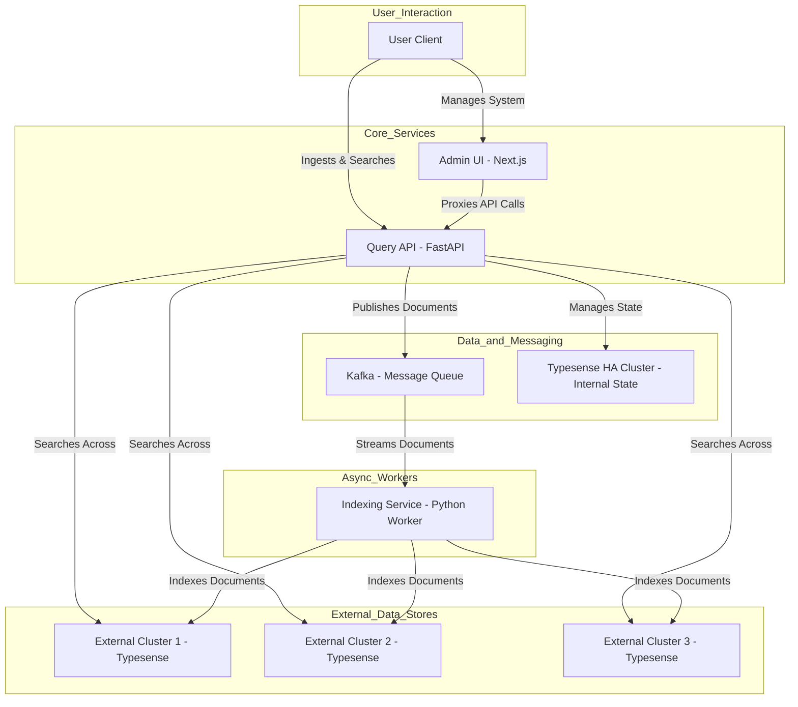

# IMPOSBRO SEARCH (Enterprise Federated Architecture)

Welcome to **IMPOSBRO SEARCH**. The name is an acronym for the Italian sentence **"il mio primo progetto open source scritto con un braccio rotto"**, reflecting the project's challenging origins.

This is a complete, enterprise-grade open-source search framework built on **Typesense**. It provides a robust solution for creating a federated search system with document-level sharding, high availability, and comprehensive management capabilities.

## Table of Contents
- [✨ Core Features](#-core-features)
- [🏛️ Architecture Overview](#️-architecture-overview)
- [🚀 Local Deployment with Docker Compose](#-local-deployment-with-docker-compose)
- [ Scaling the Typesense HA Cluster](#-scaling-the-typesense-ha-cluster)
- [🚀 Deployment to Kubernetes with Helm](#-deployment-to-kubernetes-with-helm)
- [🛣️ Roadmap & Next Steps](#️-roadmap--next-steps)

---

## ✨ Core Features

* **Advanced Document-Level Sharding:** Define routing rules based on document fields (e.g., `country`, `tenant_id`) to distribute documents across multiple physical clusters. This includes **fan-out routing**, allowing a single document to be replicated to several clusters simultaneously.
* **Resilient Scatter-Gather Search:** Queries are automatically sent to all relevant external clusters, with results merged and re-ranked. The system gracefully handles partial failures if a shard is unavailable.
* **Asynchronous Indexing:** An ingestion pipeline based on Kafka guarantees that data is indexed reliably without blocking the API.
* **HA State Management:** The application's own configuration is stored in a highly available internal Typesense cluster, ensuring no single point of failure for the management plane.
* **Fully Functional Admin UI:** A complete Next.js web interface to manage external clusters, collections, and routing rules from your browser.
* **Enterprise-Ready:** Includes message ordering via Kafka, monitoring with a full Prometheus + Grafana stack, and a resilient, scalable architecture.

---

### 🏛️ Architecture Overview

IMPOSBRO Search is built on a distributed microservices architecture designed for resilience, scalability, and maintainability. It decouples the API from the indexing process, ensures high availability of its configuration, and provides a clear separation of concerns between components.



---

### 🧩 Component Roles

* **Query API (`query-api`)**: The "brain" of the system. This FastAPI service handles all incoming requests for ingestion, federated search, and administration. It determines where documents should be routed (including fan-out logic to multiple destinations) and stores the system's configuration in the internal Typesense HA cluster.

* **Admin UI (`admin-ui`)**: The control panel. A Next.js application providing a user-friendly interface to manage all aspects of the search federation.

* **Indexing Service (`indexing-service`)**: A dedicated background worker. It consumes document ingestion messages from Kafka and reliably indexes them into the appropriate target clusters. This decouples the ingestion process from the API response, ensuring high throughput.

* **Typesense HA Cluster**: A 3-node, highly available Typesense cluster that acts as the persistent backend for the `query-api`, storing all application state and configuration using Raft consensus.

* **Kafka**: A durable message broker that acts as a buffer for ingestion requests, ensuring data integrity and decoupling document submission from indexing.

* **Prometheus & Grafana**: A standard observability stack for metrics collection, health monitoring, and performance visualization of the full system.

---

### 🔁 Data Flow Example: Document Ingestion

1. A user sends a `POST /ingest/{collection}` request with a document to the `query-api`.
2. The `query-api` loads routing rules from memory (synced with the internal Typesense HA cluster).
3. It applies those rules to decide the `target_cluster`.
4. It constructs a message with the document and cluster ID.
5. The message is published to a Kafka topic (e.g., `imposbro_search_sharded_users`).
6. The `query-api` immediately returns a 200 OK response.
7. Independently, the `indexing-service` consumes the message from Kafka.
8. It reads the cluster ID and indexes the document via the appropriate Typesense client.

---

### 🔍 Data Flow Example: Federated Search

1. A user sends a `GET /search/{collection}` request with query parameters to the `query-api`.
2. The `query-api` evaluates the routing rules to determine relevant clusters.
3. It issues parallel search queries to all matching clusters (scatter phase).
4. It handles timeouts or errors gracefully.
5. It gathers all hits from successful responses (gather phase).
6. It merges and re-ranks results based on relevance.
7. It returns a unified, paginated response as if from a single large collection.


---

## 🚀 Local Deployment with Docker Compose

### 1. Start the Services

```bash
# Navigate into the project's root directory
cd ./imposbro-search

# Copy the example environment file
# On Windows (PowerShell)
Copy-Item .env.example .env
# On macOS/Linux
# cp .env.example .env

# Build and start all services
docker-compose up --build
```

### 2. Access the UIs

* **Admin UI:** `http://localhost:3001` - **Your primary control panel.**
* **Grafana Monitoring:** `http://localhost:3000` (Login: `admin` / `admin`)

### 3. Test Document-Level Sharding

1.  **Open the Admin UI** at `http://localhost:3001`.
2.  **Register External Clusters:** Go to the **Clusters** page and register two or more external Typesense instances (e.g., `cluster-us`, `cluster-eu`).
3.  **Create a Collection:** Go to the **Collections** page and create a collection (e.g., `products`).
4.  **Define Routing Rules:** Go to the **Routing** page to configure how documents are sharded.
5.  **Ingest Sharded Data:** Use `curl` or any HTTP client to push documents.

    ```bash
    # This document might be routed to your 'cluster-us'
    curl -X POST "http://localhost:8000/ingest/products" \
      -H "Content-Type: application/json" \
      -d '{"id": "product-123", "name": "Standard Widget", "region": "USA"}'

    # This document might be routed to 'cluster-eu'
    curl -X POST "http://localhost:8000/ingest/products" \
      -H "Content-Type: application/json" \
      -d '{"id": "product-456", "name": "European Widget", "region": "EU"}'
    ```

6.  **Run a Federated Search:** This single query will hit all relevant external clusters and merge the results.
    ```bash
    curl "http://localhost:8000/search/products?q=widget&query_by=name"
    ```

---

## Scaling the Typesense HA Cluster

The architecture is designed to easily scale the internal Typesense High-Availability (HA) cluster, which is responsible for storing the application's configuration state. Adding more nodes increases fault tolerance and read performance.

**Best Practice:** It is recommended to use an odd number of nodes (3, 5, 7, etc.) in a distributed cluster to maintain a clear quorum and avoid "split-brain" scenarios.

Adding a new node (e.g., scaling from 3 to 5 nodes) is a simple, three-step configuration change. Here is how to add `typesense-4` and `typesense-5`:

### Step 1: Add New Services to `docker-compose.yml`

Copy the existing `typesense-3` service block twice and update the names and volume names.

```yaml
# In docker-compose.yml, add these new services:

  typesense-4:
    image: typesense/typesense:0.25.2
    environment:
      - TYPESENSE_API_KEY=${TYPESENSE_API_KEY}
      - TYPESENSE_DATA_DIR=/data
      - GLOG_logtostderr=1
    command: '--nodes=/app/typesense-nodes --api-key=${TYPESENSE_API_KEY}'
    volumes:
      - typesense_data_4:/data
      - ./typesense-nodes:/app/typesense-nodes

  typesense-5:
    image: typesense/typesense:0.25.2
    environment:
      - TYPESENSE_API_KEY=${TYPESENSE_API_KEY}
      - TYPESENSE_DATA_DIR=/data
      - GLOG_logtostderr=1
    command: '--nodes=/app/typesense-nodes --api-key=${TYPESENSE_API_KEY}'
    volumes:
      - typesense_data_5:/data
      - ./typesense-nodes:/app/typesense-nodes
```

You also need to declare the new volumes at the bottom of the file:

```yaml
# In the top-level 'volumes:' section of docker-compose.yml:

volumes:
  # ... existing volumes
  typesense_data_4:
  typesense_data_5:
```

### Step 2: Update the `typesense-nodes` File

Add the hostnames of the new nodes to this file so all nodes in the cluster can discover each other.

```
# In the 'typesense-nodes' file:
typesense-1:8108:http,typesense-2:8108:http,typesense-3:8108:http,typesense-4:8108:http,typesense-5:8108:http
```

### Step 3: Update the `.env` File

Finally, tell the `query_api` about the new nodes by updating the `TYPESENSE_NODES` environment variable.

```env
# In the '.env' file:
TYPESENSE_NODES=typesense-1,typesense-2,typesense-3,typesense-4,typesense-5
```

After these changes, restart the entire stack with `docker-compose up --build`. The `query_api` will automatically connect to all five nodes, and the Typesense cluster will re-balance itself. No application code changes are required.

---

## 🚀 Deployment to Kubernetes with Helm

This section describes how to deploy the application to a Kubernetes cluster.

**Prerequisites:**
* A running Kubernetes cluster.
* `kubectl` configured to connect to your cluster.
* Helm v3 installed.
* A container registry (e.g., Docker Hub, GCR, ECR) to host your Docker images.

### Step 1: Build and Push Docker Images

The Helm chart deploys pre-built images. You must first build the images and push them to your registry.

```bash
# 1. Build the application images
docker-compose build admin-ui query-api indexing-service

# 2. Tag the images for your registry
# Replace 'your-registry-user' with your registry's username/organization
docker tag imposbro-search-admin-ui your-registry-user/imposbro-admin-ui:latest
docker tag imposbro-search-query-api your-registry-user/imposbro-query-api:latest
docker tag imposbro-search-indexing-service your-registry-user/imposbro-indexing-service:latest

# 3. Push the images
docker push your-registry-user/imposbro-admin-ui:latest
docker push your-registry-user/imposbro-query-api:latest
docker push your-registry-user/imposbro-indexing-service:latest
```

### Step 2: Configure and Deploy the Helm Chart

1.  **Update `values.yaml`:** Open `helm/imposbro-search/values.yaml` and update the `image` repository values for `queryApi`, `adminUi`, and `indexingService` to match the image names you just pushed.
2.  **Install the Chart:** From the project's root directory, run the install command. This creates a new release named `imposbro-release`.
    ```bash
    helm install imposbro-release ./helm/imposbro-search
    ```
3.  **Check Status:** To check the status of your deployment, run:
    ```bash
    kubectl get all -l app.kubernetes.io/instance=imposbro-release
    ```

### Step 3: Scaling Services in Kubernetes

Kubernetes makes it easy to scale your stateless application services.

* **Scaling the `query-api`:**
    ```bash
    kubectl scale deployment imposbro-release-imposbro-search-query-api --replicas=3
    ```
* **Scaling the `indexing-service`:**
    ```bash
    kubectl scale deployment imposbro-release-imposbro-search-indexing-service --replicas=5
    ```

**Note on Stateful Services:** This Helm chart only deploys the custom applications. For a production Kubernetes deployment, you should deploy Kafka and the Typesense HA cluster using their own dedicated, official Helm charts (e.g., from Bitnami) or a Kubernetes Operator. These tools are specifically designed to manage the complexities of scaling and operating stateful services on Kubernetes.

---

## 🛣️ Roadmap & Next Steps

* [ ] Add functional and integration test suites.
* [ ] Implement support for collection aliases and live re-indexing strategies.
* [x] Finalize Helm chart for Kubernetes deployment.
* [ ] Enhance UI/UX with more feedback, loading states, and real-time metric dashboards.
* [x] Support for multi-field routing federation.
* [x] Resilient HA cluster state management.
