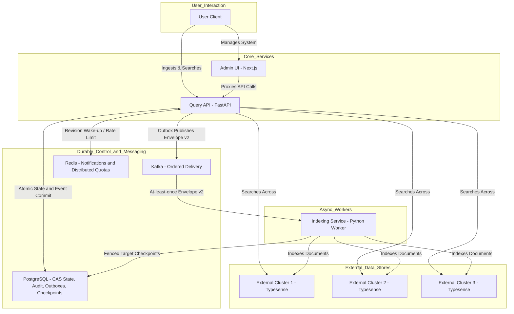

# IMPOSBRO Search (Typesense Multi-Cluster Control Plane)

Welcome to **IMPOSBRO SEARCH**. The name is an acronym for "my first open source project written with a broken arm", reflecting the project's challenging origins.

IMPOSBRO Search is an open-source control plane for operating **many physical Typesense clusters** behind one API, one ingestion path, and one operator console. It adds document-level routing, fan-out, async indexing, auditability, backup/restore, and Kubernetes release guardrails around Typesense.

It is **not** a generic search-engine replacement. Native Typesense multi-search/union search, Meilisearch federated search, Algolia multi-index search, and Elastic/OpenSearch cross-cluster search already cover large parts of the broad "federated search" market. IMPOSBRO's useful wedge is narrower: teams that want Typesense ergonomics but need to route and operate data across separate clusters for tenant, region, compliance, resilience, or scaling boundaries.

**Sharp Product Promise**

One configurable control plane for routing, ingesting, searching, observing, and operating many Typesense clusters.

**Use This When**

* You already want Typesense, but one cluster or one HA replica set is not the right operational boundary.
* Documents must be placed by tenant, country, region, compliance boundary, customer tier, or scale domain.
* You need async ingestion, cluster fan-out, partial-outage behavior, backup/restore, audit visibility, and operator workflows around multiple Typesense clusters.
* You prefer a self-hostable, inspectable, configurable layer instead of a managed search platform's pricing or control-plane assumptions.

**Do Not Use This When**

* You only need to search several collections in one Typesense cluster; use native Typesense multi-search or union search.
* You are already standardized on Elastic/OpenSearch and need broad native cross-cluster analytics.
* You need a hosted relevance platform with managed ranking, analytics, merchandising, and support; Algolia, Coveo, Elastic, or OpenSearch managed offerings may be a better buy.
* You only need a front-end federated search UI with grouped results across a few indices.

**Market Positioning**

| Alternative | What it already solves | Where IMPOSBRO is different |
|---|---|---|
| [Typesense multi-search / union search](https://typesense.org/docs/30.2/api/federated-multi-search.html) | Multiple searches in one request, including merged union results across collections. | Routes documents and queries across multiple physical Typesense clusters, with async indexing and operator state. |
| [Typesense HA](https://typesense.org/docs/guide/high-availability.html) | Node-level high availability for one replicated dataset. | Keeps separate datasets/clusters as intentional routing and governance boundaries. |
| [Meilisearch federated search](https://meilisearch.com/docs/capabilities/multi_search/getting_started/federated_search) | Merged multi-index results inside Meilisearch. | Focuses on Typesense cluster operations, routing, fan-out, and self-hosted control-plane workflows. |
| [Algolia multi-index search](https://www.algolia.com/doc/guides/building-search-ui/ui-and-ux-patterns/multi-index-search/js) | UX-oriented search across multiple Algolia indices. | Avoids managed-platform lock-in for teams that need self-hosted Typesense infrastructure and custom routing. |
| [Elastic cross-cluster search](https://www.elastic.co/docs/explore-analyze/cross-cluster-search) / [OpenSearch cross-cluster search](https://docs.opensearch.org/latest/search-plugins/cross-cluster-search/) | Native cross-cluster query for their ecosystems. | Targets teams choosing Typesense, not teams that should simply use Elastic/OpenSearch native capabilities. |

## Table of Contents
- [✨ Core Features](#-core-features)
- [🏛️ Architecture Overview](#️-architecture-overview)
- [📁 Project Structure](#-project-structure)
- [🚀 Local Deployment with Docker Compose](#-local-deployment-with-docker-compose)
- [📖 API Documentation](#-api-documentation)
- [🔧 Configuration](#-configuration)
- [📊 Scaling the Typesense HA Cluster](#-scaling-the-typesense-ha-cluster)
- [🚀 Deployment to Kubernetes with Helm](#-deployment-to-kubernetes-with-helm)
- [🛣️ Roadmap & Next Steps](#️-roadmap--next-steps)

---

## ✨ Core Features

* **Advanced Document-Level Sharding:** Define routing rules based on document fields (e.g., `country`, `tenant_id`) to distribute documents across multiple physical clusters. Routing supports exact, list, glob, and numeric range matches with priorities, dry-run previews, **fan-out routing**, and per-cluster HTTP/HTTPS transport.
* **Resilient Scatter-Gather Search:** Queries are automatically sent to all relevant external clusters, with results merged and re-ranked. The system gracefully handles partial failures if a shard is unavailable.
* **Durable Asynchronous Indexing:** PostgreSQL allocates an identity sequence and transactional outbox event before Kafka publication. Workers apply envelope v2 at least once with PostgreSQL target checkpoints, monotonic fencing, safe tombstones, bounded retries, and an explicit DLQ workflow. The platform intentionally does not make a false exactly-once claim across PostgreSQL and Typesense.
* **Transactional HA Control Plane:** PostgreSQL is the production source of truth for revisioned state, compare-and-swap mutations, audit, outboxes, routing rollouts, and worker checkpoints. Redis accelerates notifications and quotas but is never the revision authority; legacy Typesense state is read-only migration input.
* **Safe Routing Migrations:** Routing changes move through draft, validation, dual-write, resumable backfill, concurrent-event repair, exact parity, measured cutover, drain, completion, or rollback. Search and delete coverage prevents historical documents from disappearing during the move.
* **Enterprise Operator UI:** The Next.js console exposes authoritative revisions, conflicts, rollout evidence, degraded states, recovery actions, audit, confirmations, OIDC sessions, keyboard interaction, and browser-tested WCAG A/AA basics.
* **Recovery and Tamper Evidence:** State/audit/export APIs, hash-chained audit, encrypted PostgreSQL backup/restore tools, guarded DLQ resolution, SLO dashboards/alerts, and machine-readable live evidence support operations without undocumented database edits.
* **Enterprise Delivery Contract:** The repository contains fail-closed enterprise configuration, hardened Helm delivery, immutable supply-chain workflows, and local/live quality gates. A green source tree is not a customer certification: deployment-specific IdP, TLS, HA, load, DR, alert-delivery, and organizational evidence remains tied to each released environment. See [`docs/ENTERPRISE_DELIVERY_CONTRACT.md`](docs/ENTERPRISE_DELIVERY_CONTRACT.md).

---

## 🏛️ Architecture Overview

IMPOSBRO separates pure routing/authorization policy from provider adapters. A
PostgreSQL commit is authoritative; Kafka and Redis carry asynchronous work and
wake-ups, while every request uses one immutable federation snapshot.


```mermaid
graph TD;
    subgraph User_Interaction
        A[User Client];
    end

    subgraph Core_Services
        B[Admin UI - Next.js];
        C[Query API - FastAPI];
    end

    subgraph Durable_Control_and_Messaging
        D[Kafka - Ordered Delivery];
        E[PostgreSQL - CAS State, Audit, Outboxes, Checkpoints];
        R[Redis - Notifications and Distributed Quotas];
    end

    subgraph Async_Workers
        F[Indexing Service - Python Worker];
    end

    subgraph External_Data_Stores
        G[External Cluster 1 - Typesense];
        H[External Cluster 2 - Typesense];
        I[External Cluster 3 - Typesense];
    end

    A -->|Manages System| B;
    A -->|Ingests & Searches| C;

    B -->|Proxies API Calls| C;

    C -->|Atomic State and Event Commit| E;
    C -->|Outbox Publishes Envelope v2| D;
    C <-->|Revision Wake-up / Rate Limit| R;
    C -->|Searches Across| G;
    C -->|Searches Across| H;
    C -->|Searches Across| I;

    D -->|At-least-once Envelope v2| F;
    F -->|Fenced Target Checkpoints| E;
    F -->|Indexes Documents| G;
    F -->|Indexes Documents| H;
    F -->|Indexes Documents| I;

```

---

## 📁 Project Structure

The codebase follows a modular architecture with clear separation of concerns:

```
imposbro-search/
├── query_api/                    # FastAPI backend service
│   └── app/
│       ├── main.py               # Application entry point with lifespan
│       ├── settings.py           # Configuration via pydantic-settings
│       ├── models/               # Pydantic schemas
│       │   ├── __init__.py
│       │   └── schemas.py        # Request/response models
│       ├── domain/               # Provider-independent rollout state machine
│       ├── control_plane/        # PostgreSQL CAS/audit/outbox ports + adapters
│       ├── indexing_events/      # Sequenced event/outbox ports + adapters
│       ├── services/             # Application services and provider adapters
│       │   ├── __init__.py
│       │   ├── federation.py     # Cluster & routing management
│       │   ├── kafka_producer.py # Kafka message publishing
│       │   └── state_manager.py  # Desired-state orchestration/reconciliation
│       └── routers/              # API endpoints
│           ├── __init__.py
│           ├── admin.py          # Cluster, collection, routing APIs
│           └── search.py         # Search & ingestion APIs
│
├── admin_ui/                     # Next.js frontend
│   └── app/
│       ├── components/
│       │   ├── Sidebar.jsx       # Navigation sidebar
│       │   └── ui/               # Shared UI component library
│       │       ├── Button.jsx
│       │       ├── Card.jsx
│       │       ├── ConfirmationModal.jsx
│       │       ├── EmptyState.jsx
│       │       ├── Input.jsx
│       │       ├── PageHeader.jsx
│       │       └── StatusBadge.jsx
│       ├── hooks/                # Custom React hooks
│       │   └── useNotification.js
│       ├── lib/                  # Utilities
│       │   └── api.js            # Centralized API client
│       └── (pages)/              # Page components
│           ├── dashboard/
│           ├── clusters/
│           ├── collections/
│           ├── operations/
│           ├── routing/
│           └── routing-rollouts/
│
├── indexing_service/             # Kafka consumer service
│   └── app/
│       ├── main.py               # Entry point, consumer lifecycle and health
│       ├── event_envelope.py     # Strict canonical envelope v2 validation
│       ├── checkpoint_store.py   # Fenced per-target checkpoint adapters
│       └── telemetry.py          # Payload-safe OpenTelemetry boundary spans
│       └── consumer.py           # Kafka consumer with graceful shutdown
│
├── monitoring/                   # Observability stack
│   ├── grafana/
│   └── prometheus/
│
├── helm/                         # Kubernetes deployment
│
├── docker-compose.yml            # Local development setup
└── .env.example                  # Environment template
```

---

### 🧩 Component Roles

* **Query API (`query-api`)**: The "brain" of the system. This FastAPI service handles all incoming requests for ingestion, federated search, and administration. It determines where documents should be routed (including fan-out logic to multiple destinations) and stores the system's configuration in the internal Typesense HA cluster.

* **Admin UI (`admin-ui`)**: The control panel. A Next.js application providing a user-friendly interface to manage all aspects of the search federation. Built with a reusable component library for consistency.

* **Indexing Service (`indexing-service`)**: A dedicated background worker. It consumes document ingestion messages from Kafka and reliably indexes them into the appropriate target clusters. Features graceful shutdown and comprehensive logging.

* **Typesense HA Cluster**: A 3-node, highly available Typesense cluster that acts as the persistent backend for the `query-api`, storing all application state and configuration using Raft consensus.

* **Kafka**: A durable message broker that acts as a buffer for ingestion requests, ensuring data integrity and decoupling document submission from indexing.

* **Prometheus & Grafana**: A standard observability stack for metrics collection, health monitoring, performance visualization, and optional Prometheus Operator alerting of the full system.

---

### 🔁 Data Flow Example: Document Ingestion

1. A user sends a `POST /ingest/{collection}` request with a document to the `query-api`.
2. The `query-api` loads routing rules from memory (synced with the internal Typesense HA cluster).
3. It applies those rules to decide the `target_cluster`.
4. It constructs a message with the document and cluster ID.
5. The message is published to a Kafka topic (e.g., `imposbro_search_sharded_users`).
6. The `query-api` immediately returns a 200 OK response.
7. Independently, the `indexing-service` consumes the message from Kafka.
8. It reads the cluster ID and indexes the document via the appropriate Typesense client.

---

### 🔍 Data Flow Example: Federated Search

1. A user sends a `GET /search/{collection}` request with query parameters or a `POST /search/{collection}` request with a JSON body to the `query-api`.
2. The `query-api` evaluates the routing rules to determine relevant clusters.
3. It issues parallel search queries to all matching clusters (scatter phase).
4. It handles timeouts or errors gracefully.
5. It gathers all hits from successful responses (gather phase).
6. It merges and re-ranks results based on relevance.
7. It returns a unified, paginated response as if from a single large collection.


---

## 🚀 Local Deployment with Docker Compose

### 1. Start the Services

```bash
# Navigate into the project's root directory
cd ./imposbro-search

# Copy the example environment file
# On Windows (PowerShell)
Copy-Item .env.example .env
# On macOS/Linux
# cp .env.example .env

# Build and start all services
docker-compose up --build
```

### 2. Access the UIs

* **Admin UI:** `http://localhost:3001` - **Your primary control panel.**
* **API Documentation:** `http://localhost:8000/docs` - **Interactive Swagger UI**
* **Grafana Monitoring:** `http://localhost:3000` (defaults from `GRAFANA_ADMIN_USER` / `GRAFANA_ADMIN_PASSWORD`)

Docker Compose binds published ports to `127.0.0.1` by default through `HOST_BIND_IP`, matching the local-only unauthenticated defaults in `.env.example`.

### 3. Test Document-Level Sharding

1.  **Open the Admin UI** at `http://localhost:3001`.
2.  **Register External Clusters:** Go to the **Clusters** page and register two or more external Typesense instances (e.g., `cluster-us`, `cluster-eu`).
3.  **Create a Collection:** Go to the **Collections** page and create a collection (e.g., `products`). Use **Reconcile** there after restoring state or adding/recovering clusters to recreate missing desired schemas.
4.  **Define Routing Rules:** Go to the **Routing** page to configure how documents are sharded.
5.  **Inspect Control-Plane State:** Go to **Operations** for a masked snapshot.
    Enterprise backup uses the encrypted PostgreSQL workflow; plaintext
    restore-ready export is development-only.
6.  **Ingest Sharded Data:** Use `curl` or any HTTP client to push documents.

    ```bash
    # This document might be routed to your 'cluster-us'
    curl -X POST "http://localhost:8000/ingest/products" \
      -H "Content-Type: application/json" \
      -H "X-API-Key: $DATA_API_KEY" \
      -d '{"id": "product-123", "name": "Standard Widget", "region": "USA"}'

    # This document might be routed to 'cluster-eu'
    curl -X POST "http://localhost:8000/ingest/products" \
      -H "Content-Type: application/json" \
      -H "X-API-Key: $DATA_API_KEY" \
      -d '{"id": "product-456", "name": "European Widget", "region": "EU"}'
    ```

7.  **Run a Federated Search:** This single query will hit all relevant external clusters and merge the results.
    ```bash
    curl -H "X-API-Key: $DATA_API_KEY" \
      "http://localhost:8000/search/products?q=widget&query_by=name"
    ```

    For semantic/vector/hybrid search, use the JSON body endpoint so long `vector_query` values do not live in the URL:
    ```bash
    curl -X POST "http://localhost:8000/search/products" \
      -H "Content-Type: application/json" \
      -H "X-API-Key: $DATA_API_KEY" \
      -d '{
        "q": "*",
        "vector_query": "embedding:([0.1,0.2,0.3], k:10, alpha: 0.8)",
        "exclude_fields": "embedding",
        "offset": 0,
        "limit": 10
      }'
    ```
    Vector collections can be created with a `float[]` field and `num_dim`, optionally including Typesense `embed` configuration for auto-embedding fields.

8.  **Read/export by document ID:** Reads check every candidate data cluster
    and return the first authorized document match.
    ```bash
    curl -H "X-API-Key: $DATA_API_KEY" \
      "http://localhost:8000/documents/products/product-123"
    ```

9.  **Delete by document ID:** Deletions are queued through the same Kafka
    data plane and applied asynchronously by the indexing service.
    ```bash
    curl -X DELETE "http://localhost:8000/documents/products/product-123" \
      -H "X-API-Key: $DATA_API_KEY"
    ```

---

## 📖 API Documentation

The Query API provides comprehensive endpoints for search, ingestion, and administration:

### Search & Ingestion

| Endpoint | Method | Description |
|----------|--------|-------------|
| `/ingest/{collection}` | POST | Ingest a document (requires a string `id` matching `[A-Za-z0-9_.-]{1,256}`, the same contract used by read/delete routes; protected by `DATA_API_KEY` or `ingest`/`data` scoped key unless local dev bypass is enabled) |
| `/documents/{collection}/{document_id}` | GET | Retrieve/export one document by ID across candidate data clusters (protected by `DATA_API_KEY` or `search`/`data` scoped key unless local dev bypass is enabled) |
| `/documents/{collection}/{document_id}` | DELETE | Delete a document asynchronously across every candidate data cluster (protected by `DATA_API_KEY` or `ingest`/`data` scoped key unless local dev bypass is enabled) |
| `/search/{collection}` | GET | Federated search across clusters (protected by `DATA_API_KEY` or `search`/`data` scoped key unless local dev bypass is enabled) |
| `/search/{collection}` | POST | Federated search with JSON body for semantic, vector, or hybrid Typesense parameters (same auth as GET search) |

Document read requests are tenant-safe. When tenant policy is active for OIDC
callers, documents whose tenant field does not match the token's tenant claim
are returned as `404`, not as cross-tenant data.

Document delete requests are idempotent. The Query API publishes one delete event
for every cluster that may contain the collection, and the indexing worker treats
missing documents as successful no-ops. When tenant policy is active for OIDC
callers, delete events carry a server-side `id && tenant` filter so a tenant
token cannot delete another tenant's document by guessing its ID.

Batch ingest is available at `POST /ingest/{collection}/batch`. It accepts a
bounded `{"documents":[...]}` payload, applies the same data-plane auth, tenant
policy, routing, request-id propagation, and Kafka message shape as single
document ingest, and returns per-document acceptance/rejection details.
Tenant arrays on OIDC-protected writes must be a non-empty subset of the
tenants authorized by the token; one matching tenant cannot smuggle an
unauthorized tenant into a shared document.

Search responses include `clusters_queried`, `clusters_responded`, `failed_clusters`, and `partial`.
If at least one cluster responds, partial failures return `200` with `partial: true`; if every target cluster fails, the API returns `503`.
Global merge supports simple `sort_by` expressions such as `price:asc`, `_text_match:desc`, or `_vector_distance:asc`; complex geo/function sorts are rejected until they can be merged exactly across clusters. Shard windows larger than Typesense's 250-hit page limit are fetched in bounded pages, using the stored collection `default_sorting_field` when the caller does not provide a sort. `offset` and `limit` must be supplied together, and `limit_hits` must cover the requested window. The gateway always retrieves merge keys (`id` and simple sort fields) internally, then reapplies the caller's projection before returning hits. The JSON search endpoint accepts allowlisted Typesense parameters including `vector_query`, `query_by_weights`, `include_fields`, `exclude_fields`, highlighting options, and remote embedding retry/timeout controls. When `vector_query` is present, the gateway uses Typesense Multi Search so the data-cluster request is also sent as a POST body.

When fan-out duplicates are observed, an exact unique total cannot be derived
without scanning every match. In that case `found_relation` is `window_lower_bound`,
`deduplicated_found_window` describes the fetched merge window, and
`raw_found` remains the summed per-cluster upper bound. A single-cluster count is
`exact`; across multiple clusters without observed duplicates it is conservatively
labelled `upper_bound` because duplicates may exist outside the fetched window.

### Administration

`/api/v1` is canonical. The historical unversioned paths remain temporary
compatibility aliases and emit deprecation metadata.

| Endpoint | Method | Description |
|----------|--------|-------------|
| `/api/v1/admin/federation/clusters` | GET/POST | List or register desired Typesense clusters with revision metadata |
| `/api/v1/admin/federation/clusters/{name}` | DELETE | Commit removal before provider reconciliation |
| `/api/v1/admin/collections` | POST | Commit a collection schema and reconcile it to routed clusters |
| `/api/v1/admin/collections/reconcile` | POST | Reconcile missing desired schemas on registered clusters |
| `/api/v1/admin/collections/{name}` | GET/DELETE | Read desired schema or commit a routing tombstone and converge deletion |
| `/api/v1/admin/aliases` | GET | List aliases on a selected cluster |
| `/api/v1/admin/aliases/{alias}` | PUT/DELETE | Commit desired alias state before provider reconciliation |
| `/api/v1/admin/routing-rules` | POST | Set routing rules for a collection using revision CAS |
| `/api/v1/admin/routing-rules/preview` | POST | Preview rules against a document without persistence |
| `/api/v1/admin/routing-rules/{collection}` | DELETE | Remove routing rules with revision CAS |
| `/api/v1/admin/routing-map` | GET | Get complete routing configuration and revision |
| `/api/v1/admin/routing-rollouts` | GET/POST | List rollouts or create a side-effect-free draft |
| `/api/v1/admin/routing-rollouts/{id}/transitions` | POST | Apply a legal versioned lifecycle transition |
| `/api/v1/admin/routing-rollouts/{id}/backfill/steps` | POST | Run one bounded, resumable server-measured backfill/repair step |
| `/api/v1/admin/routing-rollouts/{id}/parity-verifications` | POST | Measure and persist exact parity evidence |
| `/api/v1/admin/audit-log` | GET | List sanitized operator audit events |
| `/api/v1/admin/audit-log/export` | GET | Export an ascending, digest-identified audit segment with `no-store` |
| `/api/v1/admin/state/export` | GET | Export masked state; raw-secret opt-in is rejected outside development |
| `/api/v1/admin/state/import` | POST | Dry-run validate or CAS/import an approved restore-ready snapshot |

### Health Checks

| Endpoint | Method | Description |
|----------|--------|-------------|
| `/` | GET | Basic health check |
| `/health` | GET | Detailed dependency health with Redis, Kafka, and per-data-cluster readiness |
| `/ready` | GET | Orchestrator readiness. With the default `serving` policy, initialized API pods remain routable while dependency health is degraded; `strict` requires all dependencies and data nodes to be healthy |
| `/metrics` | GET | Prometheus metrics |

---

## 🔧 Configuration

All configuration is done via environment variables. See `.env.example` for the full list:

| Variable | Description |
|----------|-------------|
| `DEPLOYMENT_PROFILE` | `development`, `production`, or fail-closed `enterprise`. Enterprise validates durable stores, identity/tenancy, TLS, audit, quotas, readiness, logs, traces, and release metadata at startup |
| `CONTROL_PLANE_STORE_BACKEND` / `CONTROL_PLANE_DATABASE_URL` | Authoritative state adapter and PostgreSQL URL. Replicated production/enterprise deployments require `postgres`; run the serialized Alembic migration first |
| `CONTROL_PLANE_RECONCILE_SECONDS` | Durable revision polling interval; Redis is only a low-latency wake-up path |
| `INDEXING_EVENT_STORE_BACKEND` | Durable per-identity sequence and indexing-outbox adapter; enterprise requires `postgres` |
| `INDEXING_CHECKPOINT_BACKEND` | Worker checkpoint adapter; replicated production/enterprise requires PostgreSQL fencing, not memory or Typesense compatibility modes |
| `KAFKA_BROKER_URL` | Kafka broker connection string |
| `KAFKA_TOPIC_PREFIX` | Prefix for Kafka topics |
| `KAFKA_SECURITY_PROTOCOL` / `KAFKA_SASL_*` / `KAFKA_SSL_*` | Kafka TLS/SASL and trust material. Enterprise accepts only verified `SSL` or `SASL_SSL` transport |
| `KAFKA_METADATA_MAX_AGE_MS` | Kafka consumer metadata refresh interval; keep low enough to discover newly created collection topics |
| `INDEXING_MAX_PROCESSING_ATTEMPTS` | Bounded indexing attempts before a poison message is published to the DLQ |
| `INDEXING_METRICS_ENABLED` | Enables the indexing worker Prometheus metrics server |
| `INDEXING_METRICS_PORT` | Port used by the indexing worker metrics server (default `9108`) |
| `REDIS_URL` | Redis connection string |
| `CONFIG_SYNC_SOURCE_ID` | Optional source id for Redis config sync; defaults to `hostname:pid` so a Query API instance ignores its own notifications while other replicas reload |
| `INTERNAL_STATE_NODES` | Comma-separated internal Typesense nodes |
| `INTERNAL_STATE_API_KEY` | API key for internal cluster |
| `INTERNAL_STATE_PROTOCOL` | Transport for internal state nodes: `http` (default) or `https` |
| `DEFAULT_DATA_CLUSTER_NODES` | Default federated cluster nodes |
| `DEFAULT_DATA_CLUSTER_API_KEY` | API key for default cluster |
| `DEFAULT_DATA_CLUSTER_PROTOCOL` | Transport for bootstrap default data nodes: `http` (default) or `https` |
| `DEFAULT_DATA2_CLUSTER_NODES` | Optional second federated cluster nodes |
| `DEFAULT_DATA2_CLUSTER_API_KEY` | API key for optional second cluster |
| `DEFAULT_DATA2_CLUSTER_PROTOCOL` | Transport for bootstrap secondary data nodes: `http` (default) or `https` |
| `INTERNAL_QUERY_API_URL` | Internal URL for service discovery |
| `HOST_BIND_IP` | Local Docker Compose bind address for published ports; defaults to `127.0.0.1` |
| `COMPOSE_SUBNET` | Local Docker Compose subnet used for stable Typesense Raft peer IPs |
| `TYPESENSE_*_IP` | Optional local Docker Compose static IP overrides for each Typesense node |
| `CORS_ORIGINS` | Optional; comma-separated origins for CORS (e.g. `http://localhost:3001`). Empty = same-origin only |
| `REQUEST_ID_HEADER` | Header echoed by Query API responses and propagated into Kafka data-plane messages for support diagnostics; default `X-Request-ID` |
| `READINESS_POLICY` | `serving` (default) keeps an initialized Query API pod ready during downstream outages so partial search remains reachable; `strict` returns readiness 503 unless dependency health is fully healthy |
| `ADMIN_API_KEY` | Admin API key; all `/admin/*` requests require `X-API-Key` or `Authorization: Bearer` unless local dev bypass is enabled |
| `SCOPED_API_KEYS` | Optional JSON array of least-privilege API keys, e.g. `[{"name":"reader","key":"secret","scopes":["search"]}]`; supported scopes are `admin`, admin subscopes (`admin:read`, `admin:write`, `admin:backup`, `admin:restore`, `admin:internal`), `search` (search/read), `ingest` (document writes/deletes), `data`, `*`, and collection patterns like `search:products_*` / `ingest:orders_*` |
| `ALLOW_UNAUTHENTICATED_ADMIN` | Local-development bypass for Admin API auth. Use `true` only for local Docker Compose, keep `false` in shared/prod environments |
| `INTERNAL_QUERY_API_ADMIN_API_KEY` | Optional service-to-service key used by the Admin UI proxy and indexing worker; defaults to `ADMIN_API_KEY` when omitted. If it differs from `ADMIN_API_KEY`, include it in `SCOPED_API_KEYS` with `admin:internal`, `admin`, or `*` scope |
| `ADMIN_UI_PUBLIC_ORIGIN` / `ADMIN_UI_SECURITY_PROFILE` | Exact public HTTPS origin and `enterprise` browser boundary. Unsafe BFF methods require matching Origin and same-origin Fetch Metadata |
| `ADMIN_UI_SERVER_CREDENTIAL_MODE` | `disabled` by default in production/enterprise; `development` is local only. `trusted-header-legacy` is a temporary double-opt-in compatibility risk and is forbidden by the enterprise chart |
| `ADMIN_UI_PROXY_TRUSTED_HEADER` / `ADMIN_UI_PROXY_TRUSTED_VALUE` | Used only by explicit legacy server-key mode; the trusted edge must strip caller copies. Prefer end-to-end OIDC |
| `ADMIN_UI_OIDC_ENABLED` | Enables browser OIDC Authorization Code + PKCE login; signed ID-token signature, nonce, audience, mandatory exact issuer, and timestamps are validated before sealing the session. Query API OIDC must validate the proxied access token |
| `ADMIN_UI_SESSION_SECRET` | Secret used to seal Admin UI HttpOnly session cookies; required and at least 32 characters when Admin UI OIDC is enabled |
| `ADMIN_UI_OIDC_CLIENT_ID` / `ADMIN_UI_OIDC_CLIENT_SECRET` | OIDC client credentials for the Admin UI login flow; client secret is optional for public-client PKCE providers |
| `ADMIN_UI_OIDC_ISSUER` | Mandatory exact OIDC issuer, whether discovery or explicit endpoints are used |
| `ADMIN_UI_OIDC_AUTHORIZATION_ENDPOINT` / `ADMIN_UI_OIDC_TOKEN_ENDPOINT` / `ADMIN_UI_OIDC_JWKS_URL` | Optional explicit HTTPS endpoints; by default each must share the issuer origin, with a deliberate origin allowlist for split providers |
| `ADMIN_UI_OIDC_FETCH_TIMEOUT_MS` | Bounded discovery/token/JWKS timeout (default 5000 ms) |
| `ADMIN_UI_OIDC_SCOPES` | Space-separated scopes requested by the Admin UI login flow; defaults to `openid profile email imposbro:admin imposbro:data` |
| `ADMIN_UI_OIDC_REDIRECT_URI` | Optional callback URL override; defaults to the request origin plus `/api/auth/callback` |
| `ADMIN_UI_SESSION_TTL_SECONDS` | Max Admin UI session lifetime; also capped by the provider token `expires_in` |
| `DATA_API_KEY` | Coarse legacy data-plane API key; grants `/ingest/*`, `/documents/*`, and `/search/*` unless narrower `SCOPED_API_KEYS` are preferred |
| `ALLOW_UNAUTHENTICATED_DATA` | Local-development bypass for data-plane auth. Use `true` only for local Docker Compose, keep `false` in shared/prod environments |
| `INTERNAL_QUERY_API_DATA_API_KEY` | Optional server-side key used by the Admin UI proxy for search/ingest/delete; defaults to `DATA_API_KEY` when omitted |
| `INGEST_BATCH_MAX_DOCUMENTS` | Maximum documents accepted by one `/ingest/{collection}/batch` request; default `100` |
| `RATE_LIMIT_ENABLED` | Enables fixed-window rate limiting for `/search/*`, document reads, `/ingest/*`, and document delete requests; default `false` for backwards-compatible upgrades |
| `RATE_LIMIT_BACKEND` | Rate-limit counter backend: `redis` for multi-replica deployments, `memory` only for single-process local/test runs |
| `RATE_LIMIT_WINDOW_SECONDS` | Fixed-window duration in seconds |
| `RATE_LIMIT_SEARCH_REQUESTS` / `RATE_LIMIT_INGEST_REQUESTS` | Per-identity request budgets per window for read-side data access (search/document read) and write-side data mutations (ingest/delete) |
| `RATE_LIMIT_FAIL_CLOSED` | When `true`, return 503 if the rate-limit backend is unavailable; default fail-open keeps traffic flowing during Redis incidents |
| `RATE_LIMIT_REDIS_PREFIX` | Redis key prefix for rate-limit counters |
| `OIDC_ENABLED` | Enables OIDC/JWT Bearer-token auth after API-key checks fail; requires issuer, audience, algorithms, and either JWKS URL or static public key |
| `OIDC_ISSUER` / `OIDC_AUDIENCE` | Expected JWT `iss` and `aud` values |
| `OIDC_JWKS_URL` / `OIDC_PUBLIC_KEY` | Exactly one signing-key source for JWT verification; asymmetric algorithms only |
| `OIDC_SCOPE_CLAIMS` | Comma-separated claim paths inspected for scopes/roles/groups (default `scope,scp,roles,groups,realm_access.roles`) |
| `OIDC_SCOPE_MAPPING` | Optional JSON map from internal scopes (`admin`, `admin:read`, `admin:write`, `admin:backup`, `admin:restore`, `admin:internal`, `search`, `ingest`, `data`) to JWT claim values |
| `OIDC_SUBJECT_CLAIM` | Claim used to derive the hashed audit actor, default `sub` |
| `AUTHZ_COLLECTION_POLICIES` | Optional JSON tenant policy per collection/pattern; can inject search filters, validate/inject ingest tenant fields, and constrain document deletes |
| `AUTHZ_API_KEY_TENANT_BYPASS` | Lets legacy API-key clients bypass tenant policy by default; set `false` when all clients use OIDC tenant claims |
| `AUTHZ_REQUIRE_COLLECTION_POLICY` | Deny collections without a matching tenant policy independently of deployment transport profile; defaults to `false` and is mandatory in enterprise mode |
| `AUDIT_LOG_ENABLED` | Enables best-effort audit logging for successful admin mutations |
| `AUDIT_LOG_MAX_RESULTS` | Maximum page size for `/admin/audit-log` |
| `OTEL_SDK_DISABLED` / `OTEL_TRACES_EXPORTER` | OpenTelemetry switch and exporter (`none` or OTLP). Enterprise requires enabled OTLP tracing |
| `OTEL_EXPORTER_OTLP_ENDPOINT` / `OTEL_EXPORTER_OTLP_TRACES_ENDPOINT` | Bounded OTLP/HTTP destination; enterprise requires HTTPS and credentials only through secret-provided headers |
| `OTEL_BUILD_ID` / `OTEL_SERVICE_REVISION` / `OTEL_DEPLOYMENT_ENVIRONMENT` | Low-cardinality release identity attached to traces and diagnostics; placeholder development values are rejected in enterprise |
| `GRAFANA_ADMIN_USER` / `GRAFANA_ADMIN_PASSWORD` | Local Grafana login for Docker Compose |

Collection and cluster names in API paths must be alphanumeric with hyphens or
underscores. Document IDs allow alphanumeric characters, hyphen, underscore,
and dot. Registered clusters persist protocol alongside host and port; legacy
snapshots without it load as `http`, while enterprise rejects plaintext data
clusters. Kafka, Redis, PostgreSQL, Typesense, OIDC, and OTLP transports expose
typed TLS/trust settings; Helm can mount a private CA and client material from
an external Secret. Admin responses, logs, traces, metrics, and evidence redact
credentials and document payloads. For Kubernetes, prefer External Secrets or
a pre-created Secret, OIDC with deny-by-default tenant policy, and the
enterprise values contract. The Admin UI authenticates operators end to end;
production server-held key injection is disabled by default.

Rate limiting is optional and config-driven. When `RATE_LIMIT_ENABLED=true`,
read-side data access (`/search/*` and `GET /documents/*`) and write-side data
mutations (`/ingest/*` and `DELETE /documents/*`) are limited separately by
authenticated actor (hashed API-key actor or OIDC actor) and collection. In
unauthenticated local development, the fallback identity is the client IP. Use
`RATE_LIMIT_BACKEND=redis` for any replicated Query API deployment so all pods
share counters. Query API exports
`query_api_rate_limit_checks_total` and `query_api_rate_limit_backend_errors_total`
so Prometheus/Grafana can track allowed requests, blocked requests, and backend
failures without exposing actors, API keys, IPs, or raw queries in metric labels.

Request correlation is always enabled. Query API accepts the configured
`REQUEST_ID_HEADER`, sanitizes unsafe values, echoes the final value on every
response, and includes it as `request_id` in Kafka ingest messages. The indexing
service logs that value during indexing/delete failures and successes, but
metrics do not label by request id to avoid high-cardinality Prometheus series.

Example collection-scoped API key:

```json
[
  {
    "name": "catalog-reader",
    "key": "secret",
    "scopes": ["search:products_*"]
  },
  {
    "name": "orders-writer",
    "key": "secret",
    "scopes": ["ingest:orders_*"]
  }
]
```

OIDC tokens can use the same resource suffix after the configured claim value, for example `imposbro:search:products_*` or `imposbro:data:tenant_a_*`.

Admin scopes are hierarchical for compatibility: `admin`, `admin:*`, `imposbro:admin`, `imposbro:admin:*`, and `imposbro:*` grant all admin operations. Use `admin:read` for non-sensitive dashboard/config reads, `admin:write` for clusters/collections/aliases/routing mutations, `admin:backup` for state export, `admin:restore` for state import validation/apply, and `admin:internal` for raw service-to-service cluster config.

Example tenant policy:

```json
{
  "collections": {
    "orders_*": {
      "mode": "required",
      "tenant_field": "tenant_id",
      "tenant_claim": "tenant_id"
    },
    "events": {
      "mode": "inject",
      "tenant_field": "tenant_id",
      "tenant_claim": "tenant_id"
    }
  }
}
```

`required` injects a server-side tenant filter into searches, constrains deletes, and rejects cross-tenant ingest. `inject` also writes a missing tenant field during ingest when the token has exactly one tenant.

### Control-plane backup and restore

Masked state exports are useful for review and migration dry-runs. Enterprise
backup uses `scripts/ops/backup-control-plane-postgres.sh`, which creates a
PostgreSQL custom archive encrypted directly to an approved `age` recipient and
preserves state, audit, outboxes, sequences and checkpoints. Store external
Secret versions through the organization-owned secret manager, not inside the
state snapshot.

The raw-secret endpoint exists only for isolated development compatibility and
is rejected by production/enterprise profiles:

```bash
curl -H "X-API-Key: $ADMIN_API_KEY" \
  "http://localhost:8000/admin/state/export?include_secrets=true" \
  > imposbro-state-backup.json
```

Validate before applying:

```bash
curl -X POST "http://localhost:8000/admin/state/import" \
  -H "Content-Type: application/json" \
  -H "X-API-Key: $ADMIN_API_KEY" \
  --data-binary @imposbro-state-backup.json
```

Apply only after validation:

```bash
curl -X POST "http://localhost:8000/admin/state/import?apply=true" \
  -H "Content-Type: application/json" \
  -H "X-API-Key: $ADMIN_API_KEY" \
  --data-binary @imposbro-state-backup.json
```

Exports without `include_secrets=true` are safe for inspection but intentionally cannot be applied because cluster API keys are masked. Never weaken the deployment profile to obtain a raw snapshot; use the encrypted backup/clean-restore runbook.
Snapshots include registered clusters, routing rules, desired collection schemas, and per-cluster collection aliases. Applying a snapshot reloads the control-plane state, reconciles desired schemas when aliases are present, and restores alias bindings.
The Admin UI **Operations** page exposes the same flow with download, file upload, dry-run validation, and an explicit apply confirmation.

---

## 📊 Scaling Model

IMPOSBRO has two different scaling surfaces:

* **Application workloads** (`query_api`, `indexing_service`, and `admin_ui`) are stateless or horizontally coordinated and are the workloads this repository scales directly.
* **Stateful dependencies** (PostgreSQL control plane, Typesense data clusters,
  Kafka, and Redis) should be scaled with their own operator, managed service,
  or dedicated runbook. The internal Typesense state cluster is a legacy
  migration source, not the enterprise authority. Do not scale production
  dependencies by copying Compose service blocks as a release procedure.

For local multi-instance validation, use the scale overlay. It removes per-replica host port bindings and publishes one local Query API endpoint through nginx:

```bash
make compose-config-scale
SCALE_QUERY_API_REPLICAS=3 SCALE_INDEXING_REPLICAS=3 make smoke-docker-scale
```

For Kubernetes, scale the IMPOSBRO application deployments or enable chart-managed HPA/KEDA:

```bash
kubectl scale deployment imposbro-release-imposbro-search-query-api --replicas=3
kubectl scale deployment imposbro-release-imposbro-search-indexing-service --replicas=5
```

Use `queryApi.autoscaling` / `adminUi.autoscaling` for CPU or memory driven request-serving workloads, and `indexingService.keda` when Kafka lag is the indexing-worker scaling signal.

The local Compose topology intentionally keeps three-node Typesense clusters with stable peer files:

* `typesense-nodes-internal` for control-plane state
* `typesense-nodes-data` for the default data cluster
* `typesense-nodes-data2` for the optional second data cluster

If you change those local stateful topologies, update the matching `*_NODES` environment variables, stable IP overrides, volumes, and peer files together, then recreate the affected volumes deliberately. For production stateful scaling, prefer the dedicated dependency tooling and capture evidence with the benchmark harness.

See [docs/RUNBOOK_SCALING.md](docs/RUNBOOK_SCALING.md) for the full scaling, lag-budget, rolling restart, rollback, and incident workflow.

---

## 🚀 Deployment to Kubernetes with Helm

This section describes how to deploy the application to a Kubernetes cluster.

**Prerequisites:**
* A running Kubernetes cluster.
* `kubectl` configured to connect to your cluster.
* Helm v3 installed.
* A container registry (e.g., Docker Hub, GCR, ECR) to host your Docker images.

### Step 1: Build and Push Docker Images

The Helm chart deploys pre-built images. You must first build the images and push them to your registry.

```bash
# 1. Build the application images
docker compose build admin_ui query_api indexing_service

# 2. Tag the images for your registry
# Replace 'your-registry-user' and '1.0.0' with your registry and release tag
docker tag imposbro-search-admin_ui your-registry-user/imposbro-admin-ui:1.0.0
docker tag imposbro-search-query_api your-registry-user/imposbro-query-api:1.0.0
docker tag imposbro-search-indexing_service your-registry-user/imposbro-indexing-service:1.0.0

# 3. Push the images
docker push your-registry-user/imposbro-admin-ui:1.0.0
docker push your-registry-user/imposbro-query-api:1.0.0
docker push your-registry-user/imposbro-indexing-service:1.0.0

# 4. Resolve the pushed digests and use these @sha256 references in Helm values
docker buildx imagetools inspect your-registry-user/imposbro-admin-ui:1.0.0
docker buildx imagetools inspect your-registry-user/imposbro-query-api:1.0.0
docker buildx imagetools inspect your-registry-user/imposbro-indexing-service:1.0.0
```

### Step 2: Configure and Deploy the Helm Chart

1.  **Create a production values file:** Start from
    `helm/enterprise-ci-values.yaml` as a non-secret shape reference. The chart
    rejects placeholder or non-digest images, volatile state/checkpoints,
    missing migrations, unauthenticated or uncovered tenants, plaintext
    dependency transports, wildcard CORS, disabled audit/rate-limit/tracing,
    unsafe Admin UI credential mode, missing HTTPS public origin, absent
    disruption/placement controls, permissive network boundaries, and inline
    production secrets. Use External Secrets or a pre-created Secret and set
    real environment endpoints, IdP, OTLP collector, trust bundle, resource/SLO
    budgets, and release identity.
    The chart exposes per-workload replicas, HPA/KEDA, PodDisruptionBudget,
    Ingress TLS, resource/probe budgets, service account, security contexts,
    affinity and topology spread, NetworkPolicy, ServiceMonitor, and
    PrometheusRule. Enterprise readiness is strict; use the more available
    `serving` readiness policy only as an explicit non-enterprise/degraded-mode
    decision.
    Enable Query API/Admin UI ingress only with exact HTTPS hosts and verify the
    controller preserves security headers and strips untrusted identity
    headers. Model DNS and every PostgreSQL, Kafka, Redis, Typesense, IdP, OTLP,
    and monitoring flow in the environment's egress policy.
2.  **Install the Chart:** From the project's root directory, run the install command. This creates a new release named `imposbro-release`.
    ```bash
    helm install imposbro-release ./helm -f production-values.yaml
    ```
3.  **Check Status:** To check the status of your deployment, run:
    ```bash
    kubectl get all -l app.kubernetes.io/instance=imposbro-release
    ```

### Step 3: Scaling Services in Kubernetes

Kubernetes makes it easy to scale your stateless application services. For manual scaling:

* **Scaling the `query-api`:**
    ```bash
    kubectl scale deployment imposbro-release-imposbro-search-query-api --replicas=3
    ```
* **Scaling the `indexing-service`:**
    ```bash
    kubectl scale deployment imposbro-release-imposbro-search-indexing-service --replicas=5
    ```

For automatic scaling, enable HPA for the Query API or Admin UI:

```yaml
queryApi:
  autoscaling:
    enabled: true
    minReplicas: 2
    maxReplicas: 6
    targetCPUUtilizationPercentage: 70
```

For Kafka-driven indexing workers, install KEDA in the cluster and enable the Kafka ScaledObject:

```yaml
indexingService:
  keda:
    enabled: true
    minReplicaCount: 1
    maxReplicaCount: 10
    kafka:
      lagThreshold: "50"
      ensureEvenDistributionOfPartitions: "true"
```

**Note on Stateful Services:** This Helm chart only deploys the custom applications. For a production Kubernetes deployment, use currently maintained vendor charts, operators, or managed services for Kafka and Typesense rather than embedding stateful infrastructure in this chart.

---

## 🛣️ Roadmap & Next Steps

### ✅ Completed

* [x] **Finalize Helm chart** for Kubernetes deployment
* [x] **Multi-field routing federation** with document-level sharding
* [x] **Transactional HA control plane** with PostgreSQL CAS, audit and outboxes
* [x] **Modular backend architecture** with separation of concerns (services/, routers/, models/)
* [x] **Reusable frontend component library** (Button, Card, Modal, Input, etc.)
* [x] **Redis Pub/Sub config sync** for multi-instance consistency
* [x] **Correct federated pagination** with deep pagination pattern
* [x] **Smart Producer architecture** eliminating routing logic duplication

### ✅ Roadmap completed (v4)

* [x] Basic live-service integration health test (`INTEGRATION=1`) plus explicit Docker smoke targets for ingest, indexing, search, outage, restore, aliases, and scaling
* [x] Collection aliases API and Admin UI workflow for zero-downtime re-indexing (`PUT/GET/DELETE /admin/aliases`)
* [x] Real-time metrics on Admin UI dashboard (polling `/admin/stats` and `/health`)
* [x] Cursor-style pagination (`offset`/`limit` and `next_offset` on search)
* [x] Admin API key authentication (optional `ADMIN_API_KEY`, `X-API-Key` / Bearer)
* [x] External Secrets/pre-created Secret integration with component-scoped
  `secretKeyRef`, deterministic rotation rollouts, and enterprise rejection of
  inline release secrets
* [x] Document fan-out (routing rule `clusters` for multi-cluster replication)
* [x] Grafana dashboard panels (documents by collection, error rate, indexing retries, DLQ)
* [x] Admin UI Operations workflow for masked export and dry-run/apply import,
  with raw-secret export confined to development and encrypted PostgreSQL
  backup/restore for enterprise
* [x] Admin UI schema reconciliation workflow with per-cluster report
* [x] Helm release validation for immutable images, required external services, required secrets, and trusted Admin UI proxy key injection
* [x] Admin UI fan-out routing editor, search pagination, advanced search tuning fields, cluster health details, and audit filters
* [x] OIDC/JWT bearer-token auth with configurable scope mapping, hashed OIDC audit actors, and optional tenant policy for search/ingest/delete
* [x] Horizontal scaling runbook and multi-instance Docker rolling smoke with Kafka lag budget
* [x] Persisted collection aliases in control-plane backup/restore snapshots
* [x] Helm HPA/KEDA autoscaling controls for Query API, Admin UI, and Kafka indexing workers
* [x] Collection-scoped data-plane RBAC for API keys and OIDC claims
* [x] Admin UI OIDC Authorization Code + PKCE login/session flow
* [x] Fine-grained admin role mapping for read, write, backup, restore, and internal service access
* [x] Configurable data-plane rate limiting for search, ingest, and delete with Redis-backed multi-replica counters
* [x] Async data-plane document deletion with tenant-safe filtered delete support
* [x] Tenant-safe data-plane document read/export by ID
* [x] Rate-limit Prometheus metrics, Grafana panels, and PrometheusRule alerts for blocked traffic and backend failures
* [x] Kubernetes ingest/search benchmark harness with JSON/Markdown output, publishable run metadata, and configurable SLO thresholds
* [x] Bounded batch ingest endpoint with per-document acceptance details and batch-aware benchmark mode
* [x] Opt-in Helm NetworkPolicy for Query API, Admin UI, and indexing metrics exposure
* [x] Opt-in Helm ServiceMonitor and PrometheusRule resources for production alerting
* [x] Opt-in Helm PodDisruptionBudget for Query API, Admin UI, and indexing workers
* [x] Per-workload Helm topology spread constraints for multi-node availability
* [x] Opt-in Helm Ingress for Query API and Admin UI with TLS, class, host, path, and annotation controls
* [x] Routing policy v2 with equals, in-list, glob, range, priority, fan-out targets, and dry-run Admin UI previews
* [x] Helm chart validation harness covering rendered resource counts, Ingress permutations, and fail-fast guardrails
* [x] Docker benchmark target that starts the local stack, runs sustained ingest/search, and writes JSON/Markdown artifacts

### 🚧 Future

The remaining items are release/environment evidence, not hidden source-code
features:

* [ ] Green hosted CI and signed release attestation on the exact reviewed commit
* [ ] Production-shaped load result for the intended cluster and document profile
* [ ] Deployment OIDC/JWKS, secret and certificate rotation drills
* [ ] Kubernetes restart/node-drain and live alert-delivery evidence
* [ ] Timed off-site backup restore, deletion convergence, and regional DR exercise
* [ ] Independent security review and first customer production acceptance

---

## 🧪 Running tests from the repo root

```bash
# Option 1: Make (Unix/macOS)
make test

# Option 2: npm (any OS)
npm run test

# Full local release gate (tests, lint, UI build, Compose config, Helm render)
make ci

# Dependency audit gate (npm root, Admin UI npm, Python requirements)
make audit

# After changing Python requirements, refresh hash-verified production locks with uv
make lock-python

# Runtime smoke: Docker stack + vector collection + document read + Kafka ingest/delete + federated search + Admin UI proxy
make smoke-docker

# Partial outage smoke: verify serving readiness stays true and search returns partial results
make smoke-docker-outage

# Load smoke: concurrent ingest through Kafka and indexed search convergence
make smoke-docker-load

# DR smoke: control-plane export/import/reconcile and alias restore against Docker stack
make smoke-docker-state

# Alias smoke: create versioned collections, switch alias, verify search follows it
make smoke-docker-alias

# Scale smoke: multi-replica Query API + indexing workers, rolling restarts, lag budget
make smoke-docker-scale

# Kubernetes or port-forward benchmark: sustained ingest/search with optional SLOs and run metadata
make benchmark-k8s

# Local Docker benchmark: start stack, run sustained ingest/search, save JSON artifact
make benchmark-docker

# Against an already running stack
make smoke-vector
make smoke-outage
make smoke-load
make smoke-state
make smoke-alias
make smoke-scale
```

Both `make test` and `npm run test` run the Query API and indexing service pytest suites plus Admin UI unit tests. See [CONTRIBUTING.md](CONTRIBUTING.md) for full test and dev setup.

`make ci` runs the local release gate: API/worker tests, Admin UI tests, lint, production build, Docker Compose validation, and Helm chart validation scenarios. Make targets use `.env` when present and fall back to `.env.example` for reproducible config validation in clean checkouts. `make smoke-docker` boots the Docker stack and verifies Kafka ingest, indexing, federated vector search, async document deletion, and the Admin UI proxy. Benchmark JSON/Markdown reports include run metadata when `BENCHMARK_ENVIRONMENT`, `BENCHMARK_RELEASE`, `BENCHMARK_CLUSTER_SHAPE`, `BENCHMARK_HELM_VALUES_REF`, and `BENCHMARK_IMAGE_SET` are set. A hosted GitHub Actions gate is still recommended, but creating workflow files requires a GitHub token with the `workflow` scope.

---

## 📐 Patterns & documentation

- **[CONTRIBUTING.md](CONTRIBUTING.md)** – How to run tests, code style, and PR process.
- **[docs/RUNBOOK_PRODUCTION.md](docs/RUNBOOK_PRODUCTION.md)** – Production topology, NetworkPolicy, deployment checklist, and disaster-recovery drills.
- **[docs/RUNBOOK_SCALING.md](docs/RUNBOOK_SCALING.md)** – Horizontal scaling, lag budget, rolling restart, rollback, and incident checks.
- **[docs/RUNBOOK_BENCHMARKING.md](docs/RUNBOOK_BENCHMARKING.md)** – Kubernetes ingest/search benchmark, JSON artifacts, and release SLO examples.
- **[docs/PATTERNS_AND_PRACTICES.md](docs/PATTERNS_AND_PRACTICES.md)** – Architectural patterns, dependency injection, security (API key masking, path validation, CORS), error handling, and checklist for new changes.
- **[PROJECT_ANALYSIS.md](PROJECT_ANALYSIS.md)** – Project analysis, improvements log, and roadmap.

## 🤝 Contributing

Contributions are welcome! Please see [CONTRIBUTING.md](CONTRIBUTING.md) for guidelines.

## 📄 License

This project is open source. See the LICENSE file for details.
