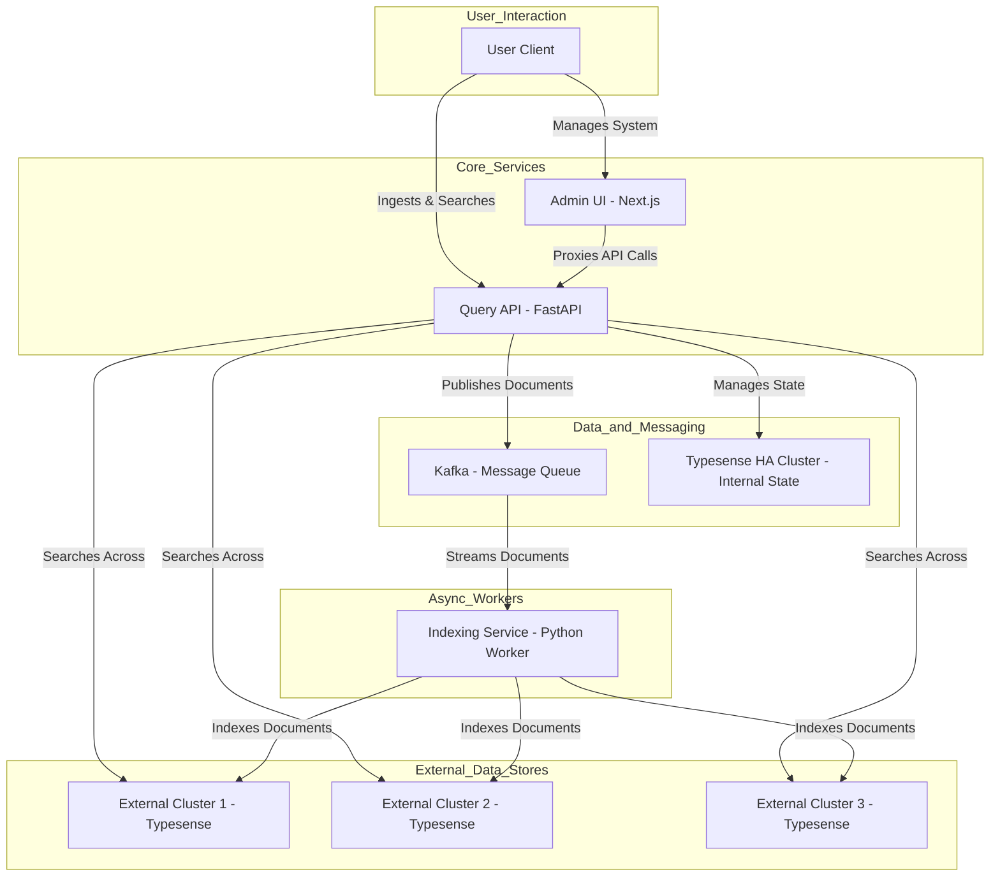

# IMPOSBRO SEARCH (Enterprise Federated Architecture)

Welcome to **IMPOSBRO SEARCH**. The name is an acronym for "my first open source project written with a broken arm", reflecting the project's challenging origins.

This is a complete, enterprise-grade open-source search framework built on **Typesense**. It provides a robust solution for creating a federated search system with document-level sharding, high availability, and comprehensive management capabilities.

## Table of Contents
- [✨ Core Features](#-core-features)
- [🏛️ Architecture Overview](#️-architecture-overview)
- [📁 Project Structure](#-project-structure)
- [🚀 Local Deployment with Docker Compose](#-local-deployment-with-docker-compose)
- [📖 API Documentation](#-api-documentation)
- [🔧 Configuration](#-configuration)
- [📊 Scaling the Typesense HA Cluster](#-scaling-the-typesense-ha-cluster)
- [🚀 Deployment to Kubernetes with Helm](#-deployment-to-kubernetes-with-helm)
- [🛣️ Roadmap & Next Steps](#️-roadmap--next-steps)

---

## ✨ Core Features

* **Advanced Document-Level Sharding:** Define routing rules based on document fields (e.g., `country`, `tenant_id`) to distribute documents across multiple physical clusters. This includes **fan-out routing**, allowing a single document to be replicated to several clusters simultaneously.
* **Resilient Scatter-Gather Search:** Queries are automatically sent to all relevant external clusters, with results merged and re-ranked. The system gracefully handles partial failures if a shard is unavailable.
* **Asynchronous Indexing:** An ingestion pipeline based on Kafka guarantees that data is indexed reliably without blocking the API.
* **HA State Management:** The application's own configuration is stored in a highly available internal Typesense cluster, ensuring no single point of failure for the management plane.
* **Fully Functional Admin UI:** A complete Next.js web interface to manage external clusters, collections, aliases, schema reconciliation, routing rules, operations, and audit visibility from your browser.
* **Operational Backup/Restore & Audit:** Control-plane state can be exported, validated, downloaded, and restored with masked-by-default secrets and explicit restore-ready workflows. Operators can inspect recent sanitized admin audit events from the Operations page.
* **Enterprise-Ready:** Includes message ordering via Kafka, monitoring with a full Prometheus + Grafana stack, and a resilient, scalable architecture.

---

## 🏛️ Architecture Overview

IMPOSBRO Search is built on a distributed microservices architecture designed for resilience, scalability, and maintainability. It decouples the API from the indexing process, ensures high availability of its configuration, and provides a clear separation of concerns between components.


```mermaid
graph TD;
    subgraph User_Interaction
        A[User Client];
    end

    subgraph Core_Services
        B[Admin UI - Next.js];
        C[Query API - FastAPI];
    end

    subgraph Data_and_Messaging
        D[Kafka - Message Queue];
        E[Typesense HA Cluster - Internal State];
    end

    subgraph Async_Workers
        F[Indexing Service - Python Worker];
    end

    subgraph External_Data_Stores
        G[External Cluster 1 - Typesense];
        H[External Cluster 2 - Typesense];
        I[External Cluster 3 - Typesense];
    end

    A -->|Manages System| B;
    A -->|Ingests & Searches| C;

    B -->|Proxies API Calls| C;

    C -->|Publishes Documents| D;
    C -->|Manages State| E;
    C -->|Searches Across| G;
    C -->|Searches Across| H;
    C -->|Searches Across| I;

    D -->|Streams Documents| F;
    F -->|Indexes Documents| G;
    F -->|Indexes Documents| H;
    F -->|Indexes Documents| I;

```

---

## 📁 Project Structure

The codebase follows a modular architecture with clear separation of concerns:

```
imposbro-search/
├── query_api/                    # FastAPI backend service
│   └── app/
│       ├── main.py               # Application entry point with lifespan
│       ├── settings.py           # Configuration via pydantic-settings
│       ├── models/               # Pydantic schemas
│       │   ├── __init__.py
│       │   └── schemas.py        # Request/response models
│       ├── services/             # Business logic layer
│       │   ├── __init__.py
│       │   ├── federation.py     # Cluster & routing management
│       │   ├── kafka_producer.py # Kafka message publishing
│       │   └── state_manager.py  # Typesense state persistence
│       └── routers/              # API endpoints
│           ├── __init__.py
│           ├── admin.py          # Cluster, collection, routing APIs
│           └── search.py         # Search & ingestion APIs
│
├── admin_ui/                     # Next.js frontend
│   └── app/
│       ├── components/
│       │   ├── Sidebar.jsx       # Navigation sidebar
│       │   └── ui/               # Shared UI component library
│       │       ├── Button.jsx
│       │       ├── Card.jsx
│       │       ├── ConfirmationModal.jsx
│       │       ├── EmptyState.jsx
│       │       ├── Input.jsx
│       │       ├── PageHeader.jsx
│       │       └── StatusBadge.jsx
│       ├── hooks/                # Custom React hooks
│       │   └── useNotification.js
│       ├── lib/                  # Utilities
│       │   └── api.js            # Centralized API client
│       └── (pages)/              # Page components
│           ├── dashboard/
│           ├── clusters/
│           ├── collections/
│           ├── operations/
│           └── routing/
│
├── indexing_service/             # Kafka consumer service
│   └── app/
│       ├── main.py               # Entry point with config fetching
│       └── consumer.py           # Kafka consumer with graceful shutdown
│
├── monitoring/                   # Observability stack
│   ├── grafana/
│   └── prometheus/
│
├── helm/                         # Kubernetes deployment
│
├── docker-compose.yml            # Local development setup
└── .env.example                  # Environment template
```

---

### 🧩 Component Roles

* **Query API (`query-api`)**: The "brain" of the system. This FastAPI service handles all incoming requests for ingestion, federated search, and administration. It determines where documents should be routed (including fan-out logic to multiple destinations) and stores the system's configuration in the internal Typesense HA cluster.

* **Admin UI (`admin-ui`)**: The control panel. A Next.js application providing a user-friendly interface to manage all aspects of the search federation. Built with a reusable component library for consistency.

* **Indexing Service (`indexing-service`)**: A dedicated background worker. It consumes document ingestion messages from Kafka and reliably indexes them into the appropriate target clusters. Features graceful shutdown and comprehensive logging.

* **Typesense HA Cluster**: A 3-node, highly available Typesense cluster that acts as the persistent backend for the `query-api`, storing all application state and configuration using Raft consensus.

* **Kafka**: A durable message broker that acts as a buffer for ingestion requests, ensuring data integrity and decoupling document submission from indexing.

* **Prometheus & Grafana**: A standard observability stack for metrics collection, health monitoring, performance visualization, and optional Prometheus Operator alerting of the full system.

---

### 🔁 Data Flow Example: Document Ingestion

1. A user sends a `POST /ingest/{collection}` request with a document to the `query-api`.
2. The `query-api` loads routing rules from memory (synced with the internal Typesense HA cluster).
3. It applies those rules to decide the `target_cluster`.
4. It constructs a message with the document and cluster ID.
5. The message is published to a Kafka topic (e.g., `imposbro_search_sharded_users`).
6. The `query-api` immediately returns a 200 OK response.
7. Independently, the `indexing-service` consumes the message from Kafka.
8. It reads the cluster ID and indexes the document via the appropriate Typesense client.

---

### 🔍 Data Flow Example: Federated Search

1. A user sends a `GET /search/{collection}` request with query parameters or a `POST /search/{collection}` request with a JSON body to the `query-api`.
2. The `query-api` evaluates the routing rules to determine relevant clusters.
3. It issues parallel search queries to all matching clusters (scatter phase).
4. It handles timeouts or errors gracefully.
5. It gathers all hits from successful responses (gather phase).
6. It merges and re-ranks results based on relevance.
7. It returns a unified, paginated response as if from a single large collection.


---

## 🚀 Local Deployment with Docker Compose

### 1. Start the Services

```bash
# Navigate into the project's root directory
cd ./imposbro-search

# Copy the example environment file
# On Windows (PowerShell)
Copy-Item .env.example .env
# On macOS/Linux
# cp .env.example .env

# Build and start all services
docker-compose up --build
```

### 2. Access the UIs

* **Admin UI:** `http://localhost:3001` - **Your primary control panel.**
* **API Documentation:** `http://localhost:8000/docs` - **Interactive Swagger UI**
* **Grafana Monitoring:** `http://localhost:3000` (defaults from `GRAFANA_ADMIN_USER` / `GRAFANA_ADMIN_PASSWORD`)

Docker Compose binds published ports to `127.0.0.1` by default through `HOST_BIND_IP`, matching the local-only unauthenticated defaults in `.env.example`.

### 3. Test Document-Level Sharding

1.  **Open the Admin UI** at `http://localhost:3001`.
2.  **Register External Clusters:** Go to the **Clusters** page and register two or more external Typesense instances (e.g., `cluster-us`, `cluster-eu`).
3.  **Create a Collection:** Go to the **Collections** page and create a collection (e.g., `products`). Use **Reconcile** there after restoring state or adding/recovering clusters to recreate missing desired schemas.
4.  **Define Routing Rules:** Go to the **Routing** page to configure how documents are sharded.
5.  **Back Up Control-Plane State:** Go to the **Operations** page to export a masked snapshot, or a restore-ready snapshot when raw cluster API keys must be included.
6.  **Ingest Sharded Data:** Use `curl` or any HTTP client to push documents.

    ```bash
    # This document might be routed to your 'cluster-us'
    curl -X POST "http://localhost:8000/ingest/products" \
      -H "Content-Type: application/json" \
      -H "X-API-Key: $DATA_API_KEY" \
      -d '{"id": "product-123", "name": "Standard Widget", "region": "USA"}'

    # This document might be routed to 'cluster-eu'
    curl -X POST "http://localhost:8000/ingest/products" \
      -H "Content-Type: application/json" \
      -H "X-API-Key: $DATA_API_KEY" \
      -d '{"id": "product-456", "name": "European Widget", "region": "EU"}'
    ```

7.  **Run a Federated Search:** This single query will hit all relevant external clusters and merge the results.
    ```bash
    curl -H "X-API-Key: $DATA_API_KEY" \
      "http://localhost:8000/search/products?q=widget&query_by=name"
    ```

    For semantic/vector/hybrid search, use the JSON body endpoint so long `vector_query` values do not live in the URL:
    ```bash
    curl -X POST "http://localhost:8000/search/products" \
      -H "Content-Type: application/json" \
      -H "X-API-Key: $DATA_API_KEY" \
      -d '{
        "q": "*",
        "vector_query": "embedding:([0.1,0.2,0.3], k:10, alpha: 0.8)",
        "exclude_fields": "embedding",
        "offset": 0,
        "limit": 10
      }'
    ```
    Vector collections can be created with a `float[]` field and `num_dim`, optionally including Typesense `embed` configuration for auto-embedding fields.

---

## 📖 API Documentation

The Query API provides comprehensive endpoints for search, ingestion, and administration:

### Search & Ingestion

| Endpoint | Method | Description |
|----------|--------|-------------|
| `/ingest/{collection}` | POST | Ingest a document (requires `id` field; protected by `DATA_API_KEY` or `ingest`/`data` scoped key unless local dev bypass is enabled) |
| `/search/{collection}` | GET | Federated search across clusters (protected by `DATA_API_KEY` or `search`/`data` scoped key unless local dev bypass is enabled) |
| `/search/{collection}` | POST | Federated search with JSON body for semantic, vector, or hybrid Typesense parameters (same auth as GET search) |

Search responses include `clusters_queried`, `clusters_responded`, `failed_clusters`, and `partial`.
If at least one cluster responds, partial failures return `200` with `partial: true`; if every target cluster fails, the API returns `503`.
Global merge supports simple `sort_by` expressions such as `price:asc`, `_text_match:desc`, or `_vector_distance:asc`; complex geo/function sorts are rejected until they can be merged exactly across clusters. The JSON search endpoint accepts allowlisted Typesense parameters including `vector_query`, `query_by_weights`, `include_fields`, `exclude_fields`, highlighting options, and remote embedding retry/timeout controls. When `vector_query` is present, the gateway uses Typesense Multi Search so the data-cluster request is also sent as a POST body.

### Administration

| Endpoint | Method | Description |
|----------|--------|-------------|
| `/admin/federation/clusters` | GET | List all registered clusters |
| `/admin/federation/clusters` | POST | Register a new cluster |
| `/admin/federation/clusters/{name}` | DELETE | Remove a cluster |
| `/admin/collections` | POST | Create a collection on all clusters |
| `/admin/collections/reconcile` | POST | Create any missing desired collection schemas on registered clusters |
| `/admin/collections/{name}` | GET | Get collection schema |
| `/admin/collections/{name}` | DELETE | Delete a collection |
| `/admin/aliases` | GET | List collection aliases on a cluster |
| `/admin/aliases/{alias}` | PUT | Create or update a collection alias for zero-downtime reindexing |
| `/admin/aliases/{alias}` | DELETE | Delete a collection alias |
| `/admin/routing-rules` | POST | Set routing rules for a collection |
| `/admin/routing-rules/{collection}` | DELETE | Delete routing rules |
| `/admin/routing-map` | GET | Get complete routing configuration |
| `/admin/audit-log` | GET | List recent successful admin mutations without exposing secrets |
| `/admin/state/export` | GET | Export control-plane state for backup; masks cluster API keys unless `include_secrets=true` |
| `/admin/state/import` | POST | Validate or import a control-plane state snapshot; defaults to dry-run, apply with `?apply=true` |

### Health Checks

| Endpoint | Method | Description |
|----------|--------|-------------|
| `/` | GET | Basic health check |
| `/health` | GET | Detailed dependency health with Redis, Kafka, and per-data-cluster readiness |
| `/ready` | GET | Readiness probe; returns HTTP 503 until required dependencies and data clusters are ready |
| `/metrics` | GET | Prometheus metrics |

---

## 🔧 Configuration

All configuration is done via environment variables. See `.env.example` for the full list:

| Variable | Description |
|----------|-------------|
| `KAFKA_BROKER_URL` | Kafka broker connection string |
| `KAFKA_TOPIC_PREFIX` | Prefix for Kafka topics |
| `KAFKA_METADATA_MAX_AGE_MS` | Kafka consumer metadata refresh interval; keep low enough to discover newly created collection topics |
| `INDEXING_MAX_PROCESSING_ATTEMPTS` | Bounded indexing attempts before a poison message is published to the DLQ |
| `INDEXING_METRICS_ENABLED` | Enables the indexing worker Prometheus metrics server |
| `INDEXING_METRICS_PORT` | Port used by the indexing worker metrics server (default `9108`) |
| `REDIS_URL` | Redis connection string |
| `CONFIG_SYNC_SOURCE_ID` | Optional source id for Redis config sync; defaults to `hostname:pid` so a Query API instance ignores its own notifications while other replicas reload |
| `INTERNAL_STATE_NODES` | Comma-separated internal Typesense nodes |
| `INTERNAL_STATE_API_KEY` | API key for internal cluster |
| `DEFAULT_DATA_CLUSTER_NODES` | Default federated cluster nodes |
| `DEFAULT_DATA_CLUSTER_API_KEY` | API key for default cluster |
| `DEFAULT_DATA2_CLUSTER_NODES` | Optional second federated cluster nodes |
| `DEFAULT_DATA2_CLUSTER_API_KEY` | API key for optional second cluster |
| `INTERNAL_QUERY_API_URL` | Internal URL for service discovery |
| `HOST_BIND_IP` | Local Docker Compose bind address for published ports; defaults to `127.0.0.1` |
| `COMPOSE_SUBNET` | Local Docker Compose subnet used for stable Typesense Raft peer IPs |
| `TYPESENSE_*_IP` | Optional local Docker Compose static IP overrides for each Typesense node |
| `CORS_ORIGINS` | Optional; comma-separated origins for CORS (e.g. `http://localhost:3001`). Empty = same-origin only |
| `ADMIN_API_KEY` | Admin API key; all `/admin/*` requests require `X-API-Key` or `Authorization: Bearer` unless local dev bypass is enabled |
| `SCOPED_API_KEYS` | Optional JSON array of least-privilege API keys, e.g. `[{"name":"reader","key":"secret","scopes":["search"]}]`; supported scopes are `admin`, admin subscopes (`admin:read`, `admin:write`, `admin:backup`, `admin:restore`, `admin:internal`), `search`, `ingest`, `data`, `*`, and collection patterns like `search:products_*` / `ingest:orders_*` |
| `ALLOW_UNAUTHENTICATED_ADMIN` | Local-development bypass for Admin API auth. Use `true` only for local Docker Compose, keep `false` in shared/prod environments |
| `INTERNAL_QUERY_API_ADMIN_API_KEY` | Optional server-side key used by the Admin UI proxy; defaults to `ADMIN_API_KEY` when omitted |
| `ADMIN_UI_PROXY_TRUSTED_HEADER` | Required in production when the Admin UI proxy injects server-side API keys; set by an authenticated ingress/gateway |
| `ADMIN_UI_PROXY_TRUSTED_VALUE` | Optional expected value for `ADMIN_UI_PROXY_TRUSTED_HEADER` |
| `ADMIN_UI_OIDC_ENABLED` | Enables browser OIDC Authorization Code + PKCE login for the Admin UI; requires Query API `OIDC_ENABLED=true` so proxied bearer sessions can be validated |
| `ADMIN_UI_SESSION_SECRET` | Secret used to seal Admin UI HttpOnly session cookies; required and at least 32 characters when Admin UI OIDC is enabled |
| `ADMIN_UI_OIDC_CLIENT_ID` / `ADMIN_UI_OIDC_CLIENT_SECRET` | OIDC client credentials for the Admin UI login flow; client secret is optional for public-client PKCE providers |
| `ADMIN_UI_OIDC_ISSUER` | OIDC issuer used for Discovery when explicit authorization/token endpoints are not set |
| `ADMIN_UI_OIDC_AUTHORIZATION_ENDPOINT` / `ADMIN_UI_OIDC_TOKEN_ENDPOINT` | Optional explicit provider endpoints; use both when not relying on Discovery |
| `ADMIN_UI_OIDC_SCOPES` | Space-separated scopes requested by the Admin UI login flow; defaults to `openid profile email imposbro:admin imposbro:data` |
| `ADMIN_UI_OIDC_REDIRECT_URI` | Optional callback URL override; defaults to the request origin plus `/api/auth/callback` |
| `ADMIN_UI_SESSION_TTL_SECONDS` | Max Admin UI session lifetime; also capped by the provider token `expires_in` |
| `DATA_API_KEY` | Coarse legacy data-plane API key; grants both `/ingest/*` and `/search/*` unless narrower `SCOPED_API_KEYS` are preferred |
| `ALLOW_UNAUTHENTICATED_DATA` | Local-development bypass for data-plane auth. Use `true` only for local Docker Compose, keep `false` in shared/prod environments |
| `INTERNAL_QUERY_API_DATA_API_KEY` | Optional server-side key used by the Admin UI proxy for search/ingest; defaults to `DATA_API_KEY` when omitted |
| `RATE_LIMIT_ENABLED` | Enables fixed-window rate limiting for `/search/*` and `/ingest/*`; default `false` for backwards-compatible upgrades |
| `RATE_LIMIT_BACKEND` | Rate-limit counter backend: `redis` for multi-replica deployments, `memory` only for single-process local/test runs |
| `RATE_LIMIT_WINDOW_SECONDS` | Fixed-window duration in seconds |
| `RATE_LIMIT_SEARCH_REQUESTS` / `RATE_LIMIT_INGEST_REQUESTS` | Per-identity request budgets per window for search and ingest |
| `RATE_LIMIT_FAIL_CLOSED` | When `true`, return 503 if the rate-limit backend is unavailable; default fail-open keeps traffic flowing during Redis incidents |
| `RATE_LIMIT_REDIS_PREFIX` | Redis key prefix for rate-limit counters |
| `OIDC_ENABLED` | Enables OIDC/JWT Bearer-token auth after API-key checks fail; requires issuer, audience, algorithms, and either JWKS URL or static public key |
| `OIDC_ISSUER` / `OIDC_AUDIENCE` | Expected JWT `iss` and `aud` values |
| `OIDC_JWKS_URL` / `OIDC_PUBLIC_KEY` | Exactly one signing-key source for JWT verification; asymmetric algorithms only |
| `OIDC_SCOPE_CLAIMS` | Comma-separated claim paths inspected for scopes/roles/groups (default `scope,scp,roles,groups,realm_access.roles`) |
| `OIDC_SCOPE_MAPPING` | Optional JSON map from internal scopes (`admin`, `admin:read`, `admin:write`, `admin:backup`, `admin:restore`, `admin:internal`, `search`, `ingest`, `data`) to JWT claim values |
| `OIDC_SUBJECT_CLAIM` | Claim used to derive the hashed audit actor, default `sub` |
| `AUTHZ_COLLECTION_POLICIES` | Optional JSON tenant policy per collection/pattern; can inject search filters and validate/inject ingest tenant fields |
| `AUTHZ_API_KEY_TENANT_BYPASS` | Lets legacy API-key clients bypass tenant policy by default; set `false` when all clients use OIDC tenant claims |
| `AUDIT_LOG_ENABLED` | Enables best-effort audit logging for successful admin mutations |
| `AUDIT_LOG_MAX_RESULTS` | Maximum page size for `/admin/audit-log` |
| `GRAFANA_ADMIN_USER` / `GRAFANA_ADMIN_PASSWORD` | Local Grafana login for Docker Compose |

Collection and cluster names in API paths must be alphanumeric with hyphens or underscores (Typesense-compatible). Admin API responses mask API keys for security. The indexing service uses an internal, admin-authenticated config endpoint so it receives unmasked cluster credentials without exposing them to the browser. It also exposes Prometheus metrics such as `indexing_documents_indexed_total`, `indexing_processing_retries_total`, and `indexing_dlq_messages_total` when `INDEXING_METRICS_ENABLED=true`. For production Kubernetes, set admin/data credentials, scoped keys, or OIDC, keep unauthenticated bypasses disabled, use the Helm Secret template (`config.useSecret: true`) for credentials, and expose the Admin UI through an authenticated Ingress/gateway or enable the Admin UI OIDC login flow.

Rate limiting is optional and config-driven. When `RATE_LIMIT_ENABLED=true`,
`/search/*` and `/ingest/*` are limited separately by authenticated actor
(hashed API-key actor or OIDC actor) and collection. In unauthenticated local
development, the fallback identity is the client IP. Use `RATE_LIMIT_BACKEND=redis`
for any replicated Query API deployment so all pods share counters. Query API
exports `query_api_rate_limit_checks_total` and
`query_api_rate_limit_backend_errors_total` so Prometheus/Grafana can track
allowed requests, blocked requests, and backend failures without exposing actors,
API keys, IPs, or raw queries in metric labels.

Example collection-scoped API key:

```json
[
  {
    "name": "catalog-reader",
    "key": "secret",
    "scopes": ["search:products_*"]
  },
  {
    "name": "orders-writer",
    "key": "secret",
    "scopes": ["ingest:orders_*"]
  }
]
```

OIDC tokens can use the same resource suffix after the configured claim value, for example `imposbro:search:products_*` or `imposbro:data:tenant_a_*`.

Admin scopes are hierarchical for compatibility: `admin`, `admin:*`, `imposbro:admin`, `imposbro:admin:*`, and `imposbro:*` grant all admin operations. Use `admin:read` for non-sensitive dashboard/config reads, `admin:write` for clusters/collections/aliases/routing mutations, `admin:backup` for state export, `admin:restore` for state import validation/apply, and `admin:internal` for raw service-to-service cluster config.

Example tenant policy:

```json
{
  "collections": {
    "orders_*": {
      "mode": "required",
      "tenant_field": "tenant_id",
      "tenant_claim": "tenant_id"
    },
    "events": {
      "mode": "inject",
      "tenant_field": "tenant_id",
      "tenant_claim": "tenant_id"
    }
  }
}
```

`required` injects a server-side tenant filter into searches and rejects cross-tenant ingest. `inject` also writes a missing tenant field during ingest when the token has exactly one tenant.

### Control-plane backup and restore

For a restore-ready backup, export with secrets into a secure location:

```bash
curl -H "X-API-Key: $ADMIN_API_KEY" \
  "http://localhost:8000/admin/state/export?include_secrets=true" \
  > imposbro-state-backup.json
```

Validate before applying:

```bash
curl -X POST "http://localhost:8000/admin/state/import" \
  -H "Content-Type: application/json" \
  -H "X-API-Key: $ADMIN_API_KEY" \
  --data-binary @imposbro-state-backup.json
```

Apply only after validation:

```bash
curl -X POST "http://localhost:8000/admin/state/import?apply=true" \
  -H "Content-Type: application/json" \
  -H "X-API-Key: $ADMIN_API_KEY" \
  --data-binary @imposbro-state-backup.json
```

Exports without `include_secrets=true` are safe for inspection but intentionally cannot be applied because cluster API keys are masked.
Snapshots include registered clusters, routing rules, desired collection schemas, and per-cluster collection aliases. Applying a snapshot reloads the control-plane state, reconciles desired schemas when aliases are present, and restores alias bindings.
The Admin UI **Operations** page exposes the same flow with download, file upload, dry-run validation, and an explicit apply confirmation.

---

## 📊 Scaling the Typesense HA Cluster

The architecture is designed to easily scale the internal Typesense High-Availability (HA) cluster, which is responsible for storing the application's configuration state. Adding more nodes increases fault tolerance and read performance.

**Best Practice:** It is recommended to use an odd number of nodes (3, 5, 7, etc.) in a distributed cluster to maintain a clear quorum and avoid "split-brain" scenarios.

Adding a new node (e.g., scaling from 3 to 5 nodes) is a simple, three-step configuration change. Here is how to add `typesense-4` and `typesense-5`:

### Step 1: Add New Services to `docker-compose.yml`

Copy the existing `typesense-3` service block twice and update the names and volume names.

```yaml
# In docker-compose.yml, add these new services:

  typesense-4:
    image: typesense/typesense:0.25.2
    environment:
      - TYPESENSE_API_KEY=${TYPESENSE_API_KEY}
      - TYPESENSE_DATA_DIR=/data
      - GLOG_logtostderr=1
    command: '--nodes=/app/typesense-nodes --api-key=${TYPESENSE_API_KEY}'
    volumes:
      - typesense_data_4:/data
      - ./typesense-nodes:/app/typesense-nodes

  typesense-5:
    image: typesense/typesense:0.25.2
    environment:
      - TYPESENSE_API_KEY=${TYPESENSE_API_KEY}
      - TYPESENSE_DATA_DIR=/data
      - GLOG_logtostderr=1
    command: '--nodes=/app/typesense-nodes --api-key=${TYPESENSE_API_KEY}'
    volumes:
      - typesense_data_5:/data
      - ./typesense-nodes:/app/typesense-nodes
```

You also need to declare the new volumes at the bottom of the file:

```yaml
# In the top-level 'volumes:' section of docker-compose.yml:

volumes:
  # ... existing volumes
  typesense_data_4:
  typesense_data_5:
```

### Step 2: Update the `typesense-nodes` File

Add the hostnames of the new nodes to this file so all nodes in the cluster can discover each other.

```
# In the 'typesense-nodes' file:
in the format hostname:peering_port:api_port
typesense-1:8107:8108,typesense-2:8107:8108,typesense-3:8107:8108,...
```

### Step 3: Update the `.env` File

Finally, tell the `query_api` about the new nodes by updating the `INTERNAL_STATE_NODES` environment variable.

```env
# In the '.env' file:
INTERNAL_STATE_NODES=typesense-1,typesense-2,typesense-3,typesense-4,typesense-5
```

After these changes, restart the entire stack with `docker-compose up --build`. The `query_api` will automatically connect to all five nodes, and the Typesense cluster will re-balance itself. No application code changes are required.

---

## 🚀 Deployment to Kubernetes with Helm

This section describes how to deploy the application to a Kubernetes cluster.

**Prerequisites:**
* A running Kubernetes cluster.
* `kubectl` configured to connect to your cluster.
* Helm v3 installed.
* A container registry (e.g., Docker Hub, GCR, ECR) to host your Docker images.

### Step 1: Build and Push Docker Images

The Helm chart deploys pre-built images. You must first build the images and push them to your registry.

```bash
# 1. Build the application images
docker compose build admin_ui query_api indexing_service

# 2. Tag the images for your registry
# Replace 'your-registry-user' and '1.0.0' with your registry and immutable release tag
docker tag imposbro-search-admin_ui your-registry-user/imposbro-admin-ui:1.0.0
docker tag imposbro-search-query_api your-registry-user/imposbro-query-api:1.0.0
docker tag imposbro-search-indexing_service your-registry-user/imposbro-indexing-service:1.0.0

# 3. Push the images
docker push your-registry-user/imposbro-admin-ui:1.0.0
docker push your-registry-user/imposbro-query-api:1.0.0
docker push your-registry-user/imposbro-indexing-service:1.0.0
```

### Step 2: Configure and Deploy the Helm Chart

1.  **Create a production values file:** The chart intentionally fails render with placeholder images, mutable `:latest` tags, missing external service URLs, or missing required auth configuration. Provide immutable image references, Kafka/Redis/Typesense endpoints, `config.useSecret: true`, API keys/scoped keys or OIDC settings, and the Typesense API keys in a secure values file. If the Admin UI proxy injects server-side API keys, configure `ADMIN_UI_PROXY_TRUSTED_HEADER` and have your authenticated ingress/gateway set that header. If the Admin UI handles browser login itself, set `ADMIN_UI_OIDC_ENABLED=true`, OIDC client settings, and `ADMIN_UI_SESSION_SECRET`.
    The chart also exposes per-workload `replicaCount`, optional HPA/KEDA autoscaling, opt-in PodDisruptionBudget, optional Ingress, `resources`, probes, service account, pod labels/annotations, node selectors, affinity, tolerations, topology spread constraints, security contexts, and opt-in NetworkPolicy. By default the Query API uses `/ready` for startup/readiness and `/` for liveness, while the Admin UI probes `/`.
    Enable `queryApi.ingress.enabled=true` and/or `adminUi.ingress.enabled=true` when the cluster ingress controller should own TLS and routing. Keep Admin UI behind an authenticated ingress/gateway whenever the proxy injects server-side keys.
    Enable `networkPolicy.enabled=true` after modeling the authenticated ingress/gateway and Prometheus namespaces. The policy allows Admin UI pods from the release to call Query API by default and leaves egress unenforced unless you provide explicit Kubernetes NetworkPolicy egress rules for DNS, Kafka, Redis, and Typesense.
2.  **Install the Chart:** From the project's root directory, run the install command. This creates a new release named `imposbro-release`.
    ```bash
    helm install imposbro-release ./helm -f production-values.yaml
    ```
3.  **Check Status:** To check the status of your deployment, run:
    ```bash
    kubectl get all -l app.kubernetes.io/instance=imposbro-release
    ```

### Step 3: Scaling Services in Kubernetes

Kubernetes makes it easy to scale your stateless application services. For manual scaling:

* **Scaling the `query-api`:**
    ```bash
    kubectl scale deployment imposbro-release-imposbro-search-query-api --replicas=3
    ```
* **Scaling the `indexing-service`:**
    ```bash
    kubectl scale deployment imposbro-release-imposbro-search-indexing-service --replicas=5
    ```

For automatic scaling, enable HPA for the Query API or Admin UI:

```yaml
queryApi:
  autoscaling:
    enabled: true
    minReplicas: 2
    maxReplicas: 6
    targetCPUUtilizationPercentage: 70
```

For Kafka-driven indexing workers, install KEDA in the cluster and enable the Kafka ScaledObject:

```yaml
indexingService:
  keda:
    enabled: true
    minReplicaCount: 1
    maxReplicaCount: 10
    kafka:
      lagThreshold: "50"
      ensureEvenDistributionOfPartitions: "true"
```

**Note on Stateful Services:** This Helm chart only deploys the custom applications. For a production Kubernetes deployment, you should deploy Kafka and the Typesense HA cluster using their own dedicated, official Helm charts (e.g., from Bitnami) or a Kubernetes Operator. These tools are specifically designed to manage the complexities of scaling and operating stateful services on Kubernetes.

---

## 🛣️ Roadmap & Next Steps

### ✅ Completed

* [x] **Finalize Helm chart** for Kubernetes deployment
* [x] **Multi-field routing federation** with document-level sharding
* [x] **Resilient HA cluster state management** with Typesense
* [x] **Modular backend architecture** with separation of concerns (services/, routers/, models/)
* [x] **Reusable frontend component library** (Button, Card, Modal, Input, etc.)
* [x] **Redis Pub/Sub config sync** for multi-instance consistency
* [x] **Correct federated pagination** with deep pagination pattern
* [x] **Smart Producer architecture** eliminating routing logic duplication

### ✅ Roadmap completed (v4)

* [x] Integration test suite (pytest marker `integration`, run with `INTEGRATION=1`)
* [x] Collection aliases API and Admin UI workflow for zero-downtime re-indexing (`PUT/GET/DELETE /admin/aliases`)
* [x] Real-time metrics on Admin UI dashboard (polling `/admin/stats` and `/health`)
* [x] Cursor-style pagination (`offset`/`limit` and `next_offset` on search)
* [x] Admin API key authentication (optional `ADMIN_API_KEY`, `X-API-Key` / Bearer)
* [x] Helm Secrets for production (optional `config.useSecret`, Secret template)
* [x] Document fan-out (routing rule `clusters` for multi-cluster replication)
* [x] Grafana dashboard panels (documents by collection, error rate, indexing retries, DLQ)
* [x] Admin UI Operations workflow for masked export, restore-ready export, dry-run import, and apply confirmation
* [x] Admin UI schema reconciliation workflow with per-cluster report
* [x] Helm release validation for immutable images, required external services, required secrets, and trusted Admin UI proxy key injection
* [x] Admin UI fan-out routing editor, search pagination, advanced search tuning fields, cluster health details, and audit filters
* [x] OIDC/JWT bearer-token auth with configurable scope mapping, hashed OIDC audit actors, and optional tenant policy for search/ingest
* [x] Horizontal scaling runbook and multi-instance Docker rolling smoke with Kafka lag budget
* [x] Persisted collection aliases in control-plane backup/restore snapshots
* [x] Helm HPA/KEDA autoscaling controls for Query API, Admin UI, and Kafka indexing workers
* [x] Collection-scoped data-plane RBAC for API keys and OIDC claims
* [x] Admin UI OIDC Authorization Code + PKCE login/session flow
* [x] Fine-grained admin role mapping for read, write, backup, restore, and internal service access
* [x] Configurable data-plane rate limiting for search and ingest with Redis-backed multi-replica counters
* [x] Rate-limit Prometheus metrics, Grafana panels, and PrometheusRule alerts for blocked traffic and backend failures
* [x] Kubernetes ingest/search benchmark harness with JSON output and configurable SLO thresholds
* [x] Opt-in Helm NetworkPolicy for Query API, Admin UI, and indexing metrics exposure
* [x] Opt-in Helm ServiceMonitor and PrometheusRule resources for production alerting
* [x] Opt-in Helm PodDisruptionBudget for Query API, Admin UI, and indexing workers
* [x] Per-workload Helm topology spread constraints for multi-node availability
* [x] Opt-in Helm Ingress for Query API and Admin UI with TLS, class, host, path, and annotation controls
* [x] Helm chart validation harness covering rendered resource counts, Ingress permutations, and fail-fast guardrails
* [x] Docker benchmark target that starts the local stack, runs sustained ingest/search, and writes a JSON artifact

### 🚧 Future

* [ ] Hosted CI workflow once GitHub credentials include the `workflow` scope
* [ ] Publish benchmark results from a production-sized Kubernetes run

---

## 🧪 Running tests from the repo root

```bash
# Option 1: Make (Unix/macOS)
make test

# Option 2: npm (any OS)
npm run test

# Full local release gate (tests, lint, UI build, Compose config, Helm render)
make ci

# Runtime smoke: Docker stack + vector collection + Kafka ingest + federated search + Admin UI proxy
make smoke-docker

# Partial outage smoke: stop the secondary data cluster and verify degraded readiness + partial search
make smoke-docker-outage

# Load smoke: concurrent ingest through Kafka and indexed search convergence
make smoke-docker-load

# DR smoke: control-plane export/import/reconcile and alias restore against Docker stack
make smoke-docker-state

# Alias smoke: create versioned collections, switch alias, verify search follows it
make smoke-docker-alias

# Scale smoke: multi-replica Query API + indexing workers, rolling restarts, lag budget
make smoke-docker-scale

# Kubernetes or port-forward benchmark: sustained ingest/search with optional SLOs
make benchmark-k8s

# Local Docker benchmark: start stack, run sustained ingest/search, save JSON artifact
make benchmark-docker

# Against an already running stack
make smoke-vector
make smoke-outage
make smoke-load
make smoke-state
make smoke-alias
make smoke-scale
```

Both `make test` and `npm run test` run the Query API and indexing service pytest suites plus Admin UI unit tests. See [CONTRIBUTING.md](CONTRIBUTING.md) for full test and dev setup.

`make ci` runs the local release gate: API/worker tests, Admin UI tests, lint, production build, Docker Compose validation, and Helm chart validation scenarios. Make targets use `.env` when present and fall back to `.env.example` for reproducible config validation in clean checkouts. `make smoke-docker` boots the Docker stack and verifies Kafka ingest, indexing, federated vector search, and the Admin UI proxy. A hosted GitHub Actions gate is still recommended, but creating workflow files requires a GitHub token with the `workflow` scope.

---

## 📐 Patterns & documentation

- **[CONTRIBUTING.md](CONTRIBUTING.md)** – How to run tests, code style, and PR process.
- **[docs/RUNBOOK_PRODUCTION.md](docs/RUNBOOK_PRODUCTION.md)** – Production topology, NetworkPolicy, deployment checklist, and disaster-recovery drills.
- **[docs/RUNBOOK_SCALING.md](docs/RUNBOOK_SCALING.md)** – Horizontal scaling, lag budget, rolling restart, rollback, and incident checks.
- **[docs/RUNBOOK_BENCHMARKING.md](docs/RUNBOOK_BENCHMARKING.md)** – Kubernetes ingest/search benchmark, JSON artifacts, and release SLO examples.
- **[docs/PATTERNS_AND_PRACTICES.md](docs/PATTERNS_AND_PRACTICES.md)** – Architectural patterns, dependency injection, security (API key masking, path validation, CORS), error handling, and checklist for new changes.
- **[PROJECT_ANALYSIS.md](PROJECT_ANALYSIS.md)** – Project analysis, improvements log, and roadmap.

## 🤝 Contributing

Contributions are welcome! Please see [CONTRIBUTING.md](CONTRIBUTING.md) for guidelines.

## 📄 License

This project is open source. See the LICENSE file for details.
