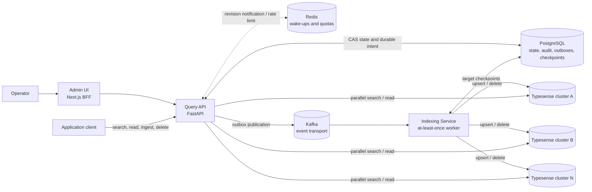
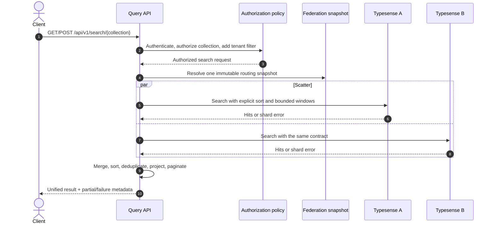

# IMPOSBRO Search

**A self-hosted control plane for routing, indexing, searching, and operating data across multiple physical Typesense clusters.**

IMPOSBRO Search keeps the Typesense search experience while adding the controls that appear when one cluster is no longer the right boundary: tenant or regional placement, fan-out, durable asynchronous indexing, federated reads, safe routing migrations, audit, observability, backup/restore, and Kubernetes delivery guardrails.

It is not a new search engine and it does not replace Typesense. It coordinates multiple Typesense clusters behind one data API and one operator console.

> The shortest mental model: the Query API decides **where** data belongs, PostgreSQL records **what must happen**, Kafka transports the work, the Indexing Service makes it happen, and Typesense serves the searchable copies.

## Start here

| If you want to… | Read |
|---|---|
| understand the whole platform | [Architecture guide](docs/README.md) |
| call or extend the backend | [Query API guide](query_api/README.md) |
| understand delivery, retries, and checkpoints | [Indexing Service guide](indexing_service/README.md) |
| operate the browser console | [Admin UI guide](admin_ui/README.md) |
| deploy to Kubernetes | [Helm guide](helm/README.md) |
| run or troubleshoot production | [Production runbook](docs/RUNBOOK_PRODUCTION.md) and [runbook index](docs/runbooks/README.md) |
| evaluate enterprise readiness | [Enterprise delivery contract](docs/ENTERPRISE_DELIVERY_CONTRACT.md) and the dated [quality-gate audit](docs/QUALITY_GATE.md) |

## What problem it solves

A normal Typesense deployment is excellent when one logical dataset can live in one cluster. A larger platform may instead need separate physical clusters because of:

- tenant, country, region, or compliance boundaries;
- independent scaling and failure domains;
- customer-specific placement or replication;
- gradual routing changes without making historical documents disappear;
- one search response assembled from several data clusters.

IMPOSBRO adds this coordination layer. Use native Typesense multi-search when all data belongs to one physical cluster; use IMPOSBRO when placement and operations across separate clusters are the actual problem.

## The platform in one diagram


```mermaid
flowchart LR
    Client["Application client"]
    Operator["Operator"]
    UI["Admin UI<br/>Next.js BFF"]
    API["Query API<br/>FastAPI"]
    PG[("PostgreSQL<br/>state, audit, outboxes, checkpoints")]
    Redis[("Redis<br/>wake-ups and quotas")]
    Kafka[("Kafka<br/>event transport")]
    Worker["Indexing Service<br/>at-least-once worker"]
    T1[("Typesense cluster A")]
    T2[("Typesense cluster B")]
    TN[("Typesense cluster N")]

    Operator --> UI --> API
    Client -->|"search, read, ingest, delete"| API
    API <-->|"CAS state and durable intent"| PG
    API <-.->|"revision notification / rate limit"| Redis
    API -->|"outbox publication"| Kafka
    Kafka --> Worker
    Worker <-->|"target checkpoints"| PG
    Worker -->|"upsert / delete"| T1
    Worker -->|"upsert / delete"| T2
    Worker -->|"upsert / delete"| TN
    API -->|"parallel search / read"| T1
    API -->|"parallel search / read"| T2
    API -->|"parallel search / read"| TN
```

The diagram shows the **enterprise profile**. Local development can use the legacy Typesense control-plane store and volatile checkpoints to reduce setup. `DEPLOYMENT_PROFILE=enterprise` rejects those shortcuts and requires PostgreSQL-backed state, events, and checkpoints plus the configured identity, tenant, TLS, rate-limit, audit, and telemetry controls.

## How a search works


```mermaid
sequenceDiagram
    autonumber
    actor C as Client
    participant A as Query API
    participant P as Authorization policy
    participant X as Federation snapshot
    participant T1 as Typesense A
    participant T2 as Typesense B

    C->>A: GET/POST /api/v1/search/{collection}
    A->>P: Authenticate, authorize collection, add tenant filter
    P-->>A: Authorized search request
    A->>X: Resolve one immutable routing snapshot
    par Scatter
        A->>T1: Search with explicit sort and bounded windows
        T1-->>A: Hits or shard error
    and
        A->>T2: Search with the same contract
        T2-->>A: Hits or shard error
    end
    A->>A: Merge, sort, deduplicate, project, paginate
    A-->>C: Unified result + partial/failure metadata
```

The API keeps one snapshot for the request, so a concurrent configuration update cannot split a search across two routing revisions. Successful shards are still useful when another shard fails: the response sets `partial=true` and identifies `failed_clusters`. If every required shard fails, the API returns an error instead of an empty success.

## How ingest and delete work

```mermaid
sequenceDiagram
    autonumber
    actor C as Client
    participant A as Query API
    participant P as PostgreSQL
    participant K as Kafka
    participant W as Indexing Service
    participant T as Typesense target(s)

    C->>A: Ingest or delete + idempotency metadata
    A->>A: Authenticate, authorize, validate, route
    A->>P: Commit identity sequence + event + outbox
    A->>K: Publish canonical envelope v2 (acks=all)
    alt Kafka acknowledged
        A->>P: Mark outbox row published
        A-->>C: Accepted with selected target(s)
    else Publication failed
        A-->>C: Error; durable event remains pending
        A->>P: Background dispatcher loads pending row
        A->>K: Replay envelope
    end
    K->>W: Deliver event at least once
    W->>P: Lock/read per-target checkpoint
    W->>T: Upsert or idempotent delete
    W->>P: Advance fenced target checkpoint
    W->>K: Commit offset after terminal target outcomes
```

The write response means PostgreSQL preparation and the synchronous Kafka acknowledgement completed; indexing is still asynchronous. If publication fails, the request returns an error while the durable outbox row remains eligible for background replay. Retries may deliver the same event again. Per-document sequence/version metadata and per-target checkpoints make stale or duplicate deliveries safe without claiming an impossible cross-system exactly-once transaction.

## Important guarantees and limits

| Concern | Contract |
|---|---|
| Control-plane writes | Revisioned compare-and-swap (CAS); enterprise mutations require the current `If-Match` revision. |
| Configuration convergence | PostgreSQL is authoritative in enterprise mode; Redis is only a low-latency wake-up. Replicas also reconcile by polling. |
| Index delivery | At least once. A worker commits its Kafka offset only after every target is terminal or the event is moved through the explicit DLQ path. |
| Fan-out | One logical event can contain several physical targets; progress is checkpointed independently per target. |
| Deletes | Asynchronous and idempotent. Missing downstream documents are successful no-ops. |
| Search failure | Partial results are explicit. Detailed health can be degraded while serving readiness remains true when useful results are still possible. |
| Result counts | Multi-cluster counts are labelled `exact`, `upper_bound`, or `window_lower_bound`; the API does not invent global exactness. |
| Routing migration | Draft → validate → dual-write → backfill/repair → parity → cutover → drain → complete, with guarded rollback. |
| Secrets | Enterprise cluster configuration stores secret references and resolves values at runtime. Materialized keys are limited to protected server-to-server paths and must not enter public/browser responses, audit, traces, metrics, or logs. |
| Disaster recovery | PostgreSQL backup/restore is encrypted and guarded. Reopening traffic still requires deletion reconciliation across every data target. |

See [the architecture guide](docs/README.md) for the precise control, data, security, migration, and recovery flows.

## Quick start for local development

Requirements: Docker with Compose v2, Git, and enough resources for Kafka, Redis, three internal Typesense nodes, two three-node data clusters, the three application services, Prometheus, and Grafana.

```bash
cp .env.example .env
docker compose up --build
```

The checked-in local profile binds published ports to `127.0.0.1` by default and intentionally enables unauthenticated local access. Do not expose this profile to a shared network.

| Service | Local URL |
|---|---|
| Admin UI | `http://localhost:3001` |
| Query API OpenAPI | `http://localhost:8000/docs` |
| Query API health | `http://localhost:8000/health` |
| Prometheus | `http://localhost:9090` |
| Grafana | `http://localhost:3000` |

Stop and remove the local containers when finished:

```bash
docker compose down --remove-orphans
```

Named volumes are retained unless you explicitly add `--volumes`.

## Minimal API tour

The stable API is available under `/api/v1`; unversioned routes remain for compatibility. Production callers should use `/api/v1`.

The examples below assume that an operator has first registered a data cluster, created a `products` collection with at least `name` and `region` string fields, and configured a default route. The easiest local path is **Clusters → Collections → Routing** in the Admin UI. Ingest is rejected when no valid target exists.

```bash
# Ingest. Searchability is eventual, not immediate.
curl -X POST http://localhost:8000/api/v1/ingest/products \
  -H 'Content-Type: application/json' \
  -d '{"id":"product-123","name":"Standard Widget","region":"EU"}'

# Federated lexical search.
curl 'http://localhost:8000/api/v1/search/products?q=widget&query_by=name'

# Vector/hybrid parameters belong in a JSON body, not a long URL.
curl -X POST http://localhost:8000/api/v1/search/products \
  -H 'Content-Type: application/json' \
  -d '{"q":"*","vector_query":"embedding:([0.1,0.2], k:10)","exclude_fields":"embedding"}'

# Read/export one authorized document.
curl http://localhost:8000/api/v1/documents/products/product-123

# Queue an idempotent asynchronous deletion.
curl -X DELETE http://localhost:8000/api/v1/documents/products/product-123
```

When authentication is enabled, pass `X-API-Key` or an OIDC bearer token with the required collection-aware scope. Tenant policy is enforced server-side for search, read, ingest, and delete.

## Configuration profiles

Configuration is environment-driven and validated at process startup. Start from [.env.example](.env.example) for local Compose and [helm/values.yaml](helm/values.yaml) for Kubernetes.

| Profile | Purpose | Key behavior |
|---|---|---|
| Local/default | Development and smoke tests | May use legacy Typesense state/checkpoints, disabled or in-memory event persistence, plaintext loopback dependencies, and explicit unauthenticated bypasses. |
| Enterprise | Production-oriented fail-closed validation | Requires PostgreSQL stores/checkpoints, OIDC and collection/tenant policy, distributed fail-closed rate limits, TLS-protected dependencies and OTLP, tamper-evident durable audit/export, runtime secret references, and immutable release metadata. |

The profile is a validation boundary, not a certification. Production still needs an environment-specific IdP, certificates, external secret management, HA dependencies, network policy, backup custody, external audit delivery where required, alert delivery, load evidence, and an owned operational process.

## Deployment

- Local stack: [Docker Compose configuration](docker-compose.yml)
- Kubernetes: [Helm deployment guide](helm/README.md)
- Multi-node disposable acceptance environment: [kind guide](ops/kind/README.md)
- Horizontal scale: [scaling runbook](docs/RUNBOOK_SCALING.md)
- Release and rollback: [release contract](docs/RELEASE_ROLLBACK.md)
- Supply chain: [signed images, SBOM, and attestations](docs/SUPPLY_CHAIN.md)

The Helm chart deliberately does not install PostgreSQL, Kafka, Redis, an identity provider, certificate manager, secret manager, Prometheus stack, or external Typesense clusters. Those are environment-owned dependencies with separate lifecycle and recovery requirements.

## Verification

```bash
# Unit/integration suites for Python and the Admin UI
npm test

# Python and Admin UI tests through Make
make test

# Full local repository gate
make ci

# Repository-owned operational contracts
scripts/ops/validate-ops-artifacts.sh
```

Additional live, scale, partial-outage, benchmark, Kubernetes, and DR harnesses are mapped in [docs/TEST_MATRIX.md](docs/TEST_MATRIX.md). A checked-in report proves only the commit, environment, and scenario named in that report.

## Repository map

```text
query_api/          FastAPI control plane and synchronous read path
indexing_service/   Kafka consumer and durable per-target delivery
admin_ui/           Next.js operator console and server-side API proxy
helm/               Kubernetes chart and enterprise validation profile
monitoring/         Prometheus, Alertmanager, exporters, and Grafana contracts
ops/                Backup, restore, kind, and operational assets
contracts/          OpenAPI and canonical indexing-event schemas
docs/               Architecture, security, SLO, tests, ADRs, and runbooks
tests/               Cross-component enterprise and Kubernetes harnesses
```

## Project status and non-claims

The repository implements the platform and automated quality gates described above. It does **not** claim that every deployment is automatically enterprise-certified, highly available, compliant, or within an SLO. Those outcomes depend on the exact infrastructure, configuration, evidence, and operating organization. The authoritative acceptance boundary is [docs/ENTERPRISE_DELIVERY_CONTRACT.md](docs/ENTERPRISE_DELIVERY_CONTRACT.md).

## Contributing and license

See [CONTRIBUTING.md](CONTRIBUTING.md) before proposing a change. IMPOSBRO Search is released under the [MIT License](LICENSE).
