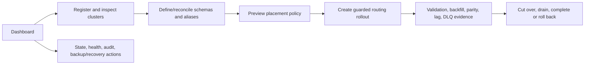
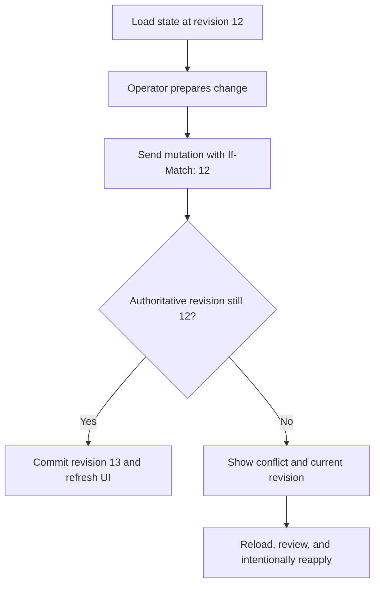

# Admin UI

The Admin UI is the operator console for IMPOSBRO Search. It is a Next.js application with a server-side backend-for-frontend (BFF): the browser talks only to the UI origin, while the BFF authenticates the session and proxies authorized requests to the Query API.

The UI is not a second control plane. PostgreSQL and the Query API remain authoritative; the UI presents revisioned state and operator workflows.

## Browser and identity boundary

```mermaid
sequenceDiagram
    autonumber
    actor O as Operator browser
    participant U as Admin UI / BFF
    participant I as OIDC provider
    participant A as Query API

    O->>U: Open protected console
    U-->>O: Redirect with PKCE, state, and nonce
    O->>I: Authenticate
    I-->>O: Authorization code
    O->>U: OIDC callback
    U->>I: Exchange code; validate token and claims
    U-->>O: OIDC mode: sealed HttpOnly same-site session cookie
    O->>U: Same-origin /api request
    U->>U: OIDC/production mode: validate session and mutation provenance
    U->>A: Query API request + caller/session/server credential
    A->>A: Enforce scope, collection, tenant, and revision
    A-->>U: Upstream response
    U->>U: Apply response-header allowlist
    U-->>O: Operator-safe response
```

When browser OIDC is disabled for a controlled local profile, the BFF can use configured server-side credentials. Those credentials never enter the client bundle. Production-like startup validates the identity/session configuration and fails closed on unsafe combinations.

## Why the BFF exists

Direct browser-to-Query-API calls would expose more cross-origin, credential, and header trust complexity. The BFF provides one narrow boundary:

- OIDC mode uses a same-origin, sealed `HttpOnly` session;
- OIDC Authorization Code + PKCE, state, nonce, issuer, signature, audience, and time claims are validated server-side;
- OIDC/production-like mutation requests enforce origin and `Sec-Fetch-Site` expectations; the isolated local bypass does not;
- cookies, host, hop-by-hop, and configured trusted-proxy identity headers are stripped;
- caller-supplied `Authorization`/`X-API-Key` can be forwarded; otherwise the BFF injects a validated bearer or explicitly enabled server credential;
- only an explicit response-header allowlist is returned to the browser;
- the Query API still performs every authorization decision.

The detailed contract is [../docs/ADMIN_UI_SECURITY.md](../docs/ADMIN_UI_SECURITY.md).

## Operator workflows



The console includes pages for dashboard status, clusters, collections, routing, routing rollouts, workspace/search operations, and operational diagnostics. Sensitive/destructive actions use explicit confirmation and expose success, conflict, degraded, and recovery states rather than hiding them.

### Revision conflicts

The centralized API client remembers only monotonically newer revision/ETag values returned by control-plane reads and automatically sends the latest value with later admin mutations. Routing rollouts can pass an explicit revision, which takes precedence. If another operator or replica has already committed a change, the Query API returns a conflict instead of overwriting the new state.



## Routing rollout UX

Enterprise routing changes are represented as a state machine rather than a one-click overwrite. The UI displays the current phase, version, read/write coverage, machine evidence, allowed next transitions, rollback window, and failure reason.

Operator input is intentionally limited: validation and capacity can be attested by an authorized operator; backfill progress, exact parity, producer/consumer lag, and unresolved DLQ evidence come from the system. This prevents a UI checkbox from fabricating cutover safety.

See [../docs/README.md](../docs/README.md#7-safe-routing-changes) for the full phase diagram.

## Search workspace

The workspace calls the versioned data API through the BFF. It supports the repository's lexical, filtered, vector, and hybrid request shapes while keeping long/sensitive vector parameters in a POST body. Search results expose partial-cluster and count-precision metadata so operators can distinguish “no match” from “one shard unavailable.”

## Security headers and browser controls

`next.config.js` builds a validated security-header baseline including CSP, frame protection, content-type protection, referrer policy, and production HSTS. Environment-specific trusted origins and CSP sources are configuration, not hardcoded application assumptions.

The application also provides:

- semantic labels, keyboard interaction, focus treatment, and automated WCAG A/AA-oriented checks;
- no-store behavior for identity and sensitive proxy responses;
- safe error normalization rather than leaking upstream credentials/details;
- explicit loading, empty, error, degraded, unauthorized, dirty, saved, and conflict states where applicable.

Automated accessibility checks are evidence for tested paths, not a universal certification.

## Configuration

Important runtime/build groups:

| Group | Representative settings |
|---|---|
| Backend | `INTERNAL_QUERY_API_URL`, server-side internal/admin/data credentials |
| Browser OIDC | enable flag, issuer, authorization/token/JWKS endpoints, client ID/secret, scopes, redirect URI |
| Session | signing/sealing key, cookie name/lifetime, secure production behavior |
| Endpoint trust | allowed OIDC endpoint origins, local-only insecure escape hatch, fetch timeout |
| Browser policy | CSP, frame ancestors, HSTS, referrer and content-type settings |
| Deployment | immutable image/release metadata and production-like profile |

See [../.env.example](../.env.example) and [../helm/values.yaml](../helm/values.yaml). Values available to browser code must never contain API keys, OIDC client secrets, session keys, or cluster credentials.

## Code map

```text
app/(pages)/                operator screens and workflows
app/api/[[...path]]/        hardened same-origin Query API proxy
app/api/auth/               OIDC login, callback, session, logout, status
app/components/             reusable workflow and UI components
app/hooks/                  shared client-side behavior
app/lib/adminAuth.js        OIDC/session/mutation security boundary
app/lib/api.js              centralized Query API client and revision propagation
app/lib/routingRollouts.js  rollout view/state helpers
tests/                      node tests for proxy, auth, config, security, UI logic
e2e/                        Playwright enterprise operator workflow
next.config.js              standalone output and validated security headers
```

## Development

From the repository root:

```bash
npm --prefix admin_ui install
npm --prefix admin_ui run dev
```

The development script expects the Query API at `http://localhost:8000`. For the complete local system, use the root Docker Compose quick start instead.

## Verification

```bash
npm --prefix admin_ui test
npm --prefix admin_ui run lint
npm --prefix admin_ui run build

# Requires a configured running stack and Playwright browser dependencies
npm --prefix admin_ui run test:e2e
```

Changes to login, session, proxying, mutation controls, trusted headers, or routing transitions should include focused regression tests and be checked against [../docs/ADMIN_UI_SECURITY.md](../docs/ADMIN_UI_SECURITY.md) and [../docs/THREAT_MODEL.md](../docs/THREAT_MODEL.md).
