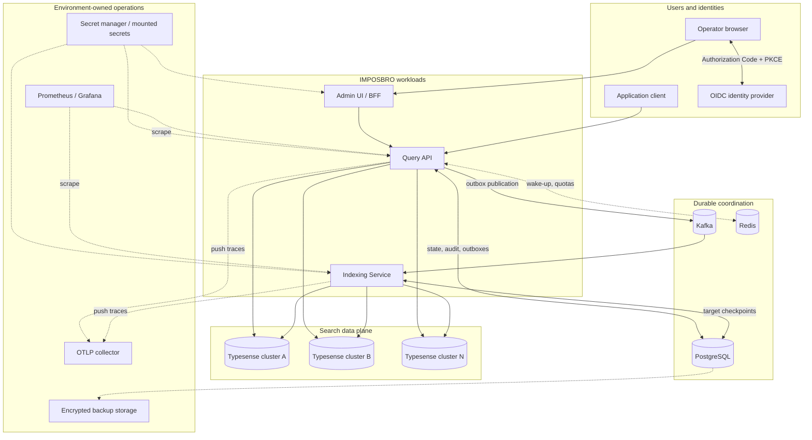
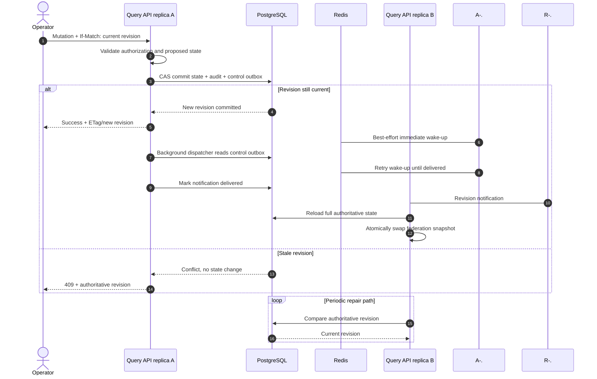
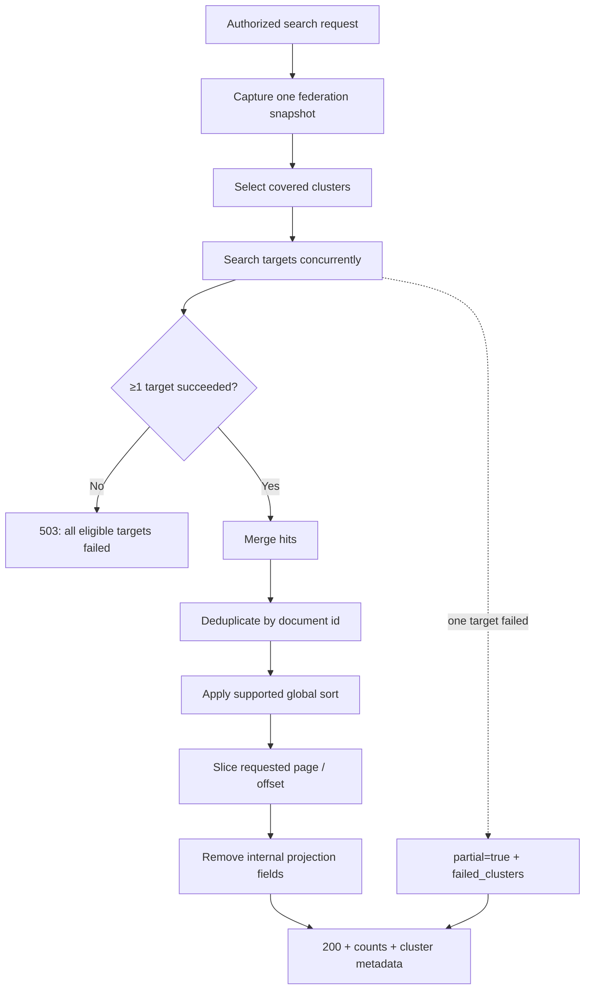
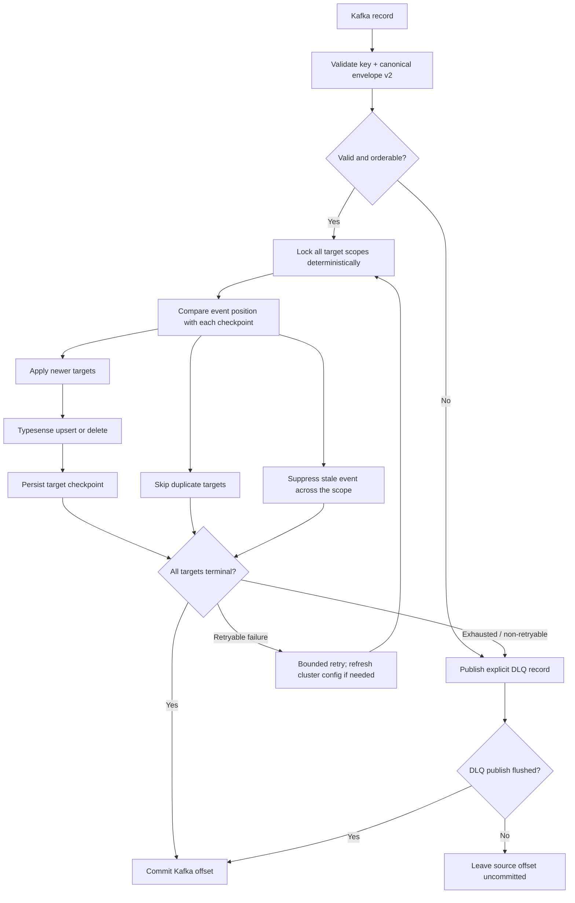
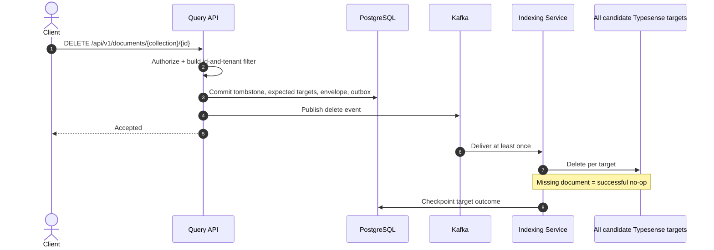
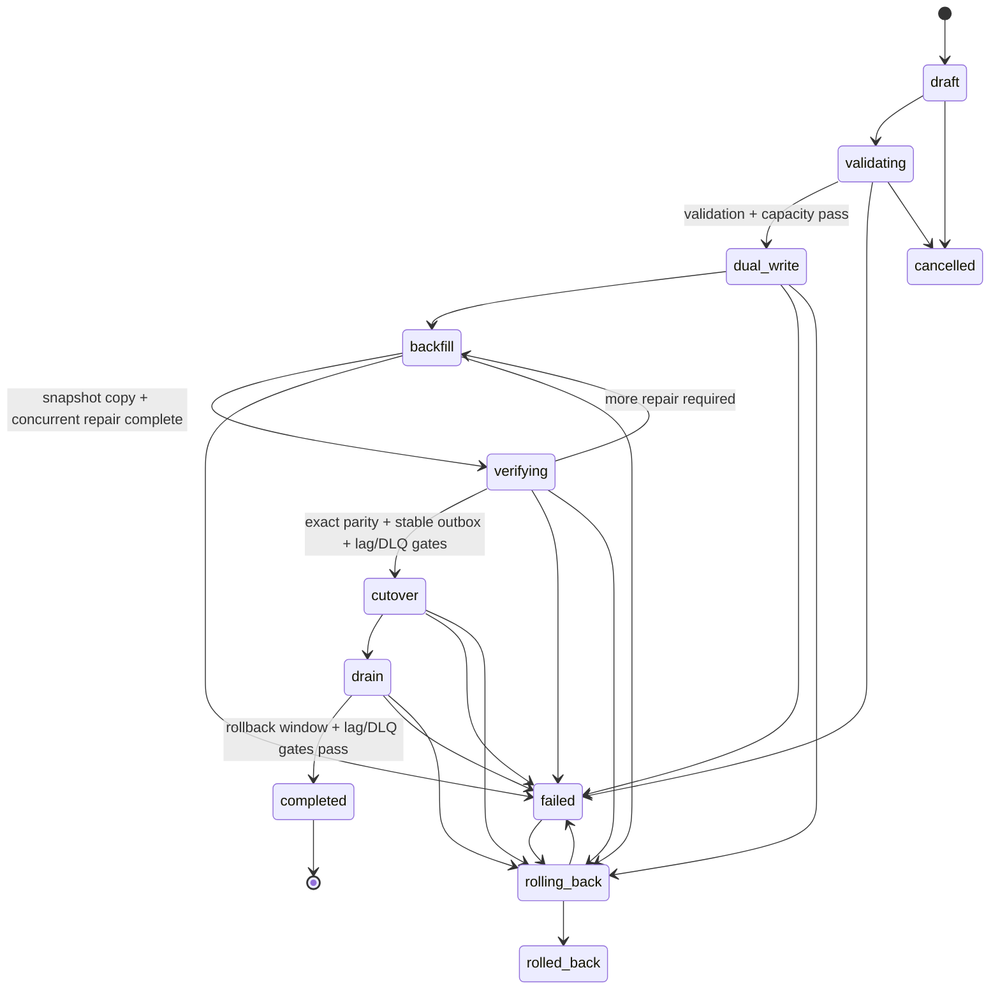
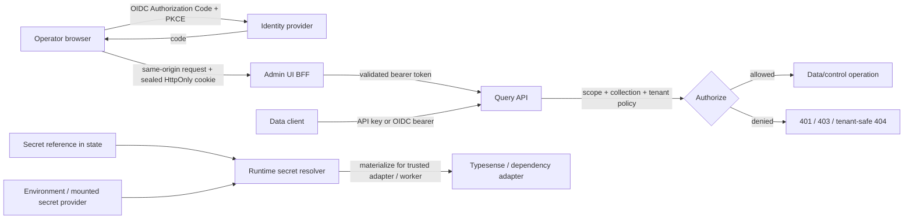
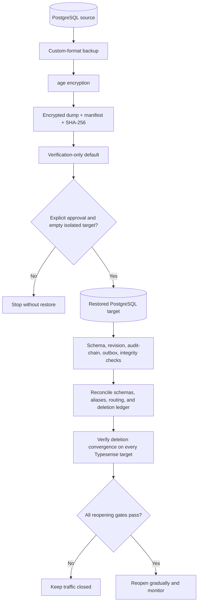
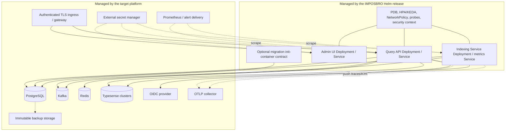

# IMPOSBRO Search architecture guide

This page explains how the platform works from end to end. It is intentionally simple enough to read first and precise enough to use during design, implementation, and incident response.

## Reading map

| Topic | Primary document |
|---|---|
| Query, admin, health, and API behavior | [Query API](../query_api/README.md) |
| Event processing, retries, checkpoints, and DLQ | [Indexing Service](../indexing_service/README.md) |
| Browser console, BFF, and operator identity | [Admin UI](../admin_ui/README.md) |
| Kubernetes deployment and chart boundaries | [Helm chart](../helm/README.md) |
| Data retention and deletion convergence | [Data lifecycle](DATA_LIFECYCLE.md) |
| Authentication and trust boundaries | [Threat model](THREAT_MODEL.md) and [ASVS baseline](ASVS_BASELINE.md) |
| Traces, metrics, SLOs, and alerts | [Observability](OBSERVABILITY.md), [SLO](SLO.md), and [monitoring](../monitoring/README.md) |
| Backup, restore, and rollback | [Production runbook](RUNBOOK_PRODUCTION.md), [DR exercise](../ops/dr/README.md), and [release rollback](RELEASE_ROLLBACK.md) |
| Architecture decisions | [ADR directory](adr/) |
| Requirements and test evidence | [Delivery contract](ENTERPRISE_DELIVERY_CONTRACT.md), [test matrix](TEST_MATRIX.md), and dated [quality-gate audit](QUALITY_GATE.md) |
| Alert response | [Runbook index](runbooks/README.md) |

[PROJECT_ANALYSIS.md](../PROJECT_ANALYSIS.md), [QUALITY_GATE.md](QUALITY_GATE.md), tabletop records, and files under `docs/evidence/` may contain a date or commit-specific assessment. Treat them as evidence for the scope they name, not as timeless proof about another deployment.

## 1. System boundaries

IMPOSBRO has two logical planes:

- the **data plane** accepts writes, searches data, reads documents, and deletes documents;
- the **control plane** manages clusters, schemas, aliases, routing policies, safe rollouts, audit, and recovery state.

They share one Query API process today, but their contracts and permissions are separate.



### Ownership table

| Component | Owns | Does not own |
|---|---|---|
| Admin UI | Operator workflow, OIDC browser session, same-origin BFF | Routing truth, data authorization, database credentials in the browser |
| Query API | Auth/authz, tenant policy, routing, federation, control-plane mutations, search merge | Long-running indexing or infrastructure lifecycle |
| PostgreSQL | Enterprise state revision, digest, audit chain, control and indexing outboxes, identity heads, deletion ledger, worker checkpoints | Searchable document copies |
| Redis | Fast configuration wake-ups and distributed quota counters | Authoritative configuration or durable event history |
| Kafka | Per-key event transport and consumer offsets | Global ordering or cross-system transactions |
| Indexing Service | Envelope validation and per-target delivery decisions | Recomputing routing policy |
| Typesense clusters | Searchable schemas, aliases, and document copies | Enterprise control-plane authority |

## 2. Configuration state and replica convergence

Every PostgreSQL-backed enterprise control-plane state has a monotonically increasing revision and a content digest. Enterprise writes use compare-and-swap so two operators cannot silently overwrite one another. The legacy Typesense adapter does not provide the same revision/digest contract.



Redis is not trusted as storage. If Pub/Sub loses a message, polling eventually repairs convergence. Each request captures one immutable in-memory federation snapshot; a reload swaps the whole snapshot rather than mutating pieces underneath an active request.

The default local profile can use the legacy Typesense-backed state adapter. Enterprise validation requires `CONTROL_PLANE_STORE_BACKEND=postgres`. Legacy state is a compatibility and migration input, not the production authority described above.

## 3. Federated search

Search selection is collection/read-policy coverage, not document-routing-by-query. The API searches every cluster that may contain relevant copies under the current rollout phase.



Important details:

- tenant policy is injected before the query leaves the Query API;
- shard windows are fetched in Typesense-sized pages (maximum 250 per call) up to the platform's bounded merge window;
- explicit sort keys and document identity can be added to the internal projection, then removed from the caller's final projection;
- the best copy of a duplicate document ID is kept;
- simple supported relevance, vector-distance, and field sorts are made consistent across shards and the global merge; unsupported complex sort expressions fail explicitly;
- a single-shard count can be `exact`; a federated count is labelled `upper_bound` or `window_lower_bound` when global exactness cannot be proven from the fetched window.

Readiness is intentionally different from detailed health. An initialized replica may stay ready while one data cluster is down because it can still return explicit partial results. Strict dependency readiness is available for environments whose policy requires every dependency to be healthy.

## 4. Durable ingest and update

The Query API is the smart producer: it evaluates priority-ordered exact, list, glob, and numeric-range rules and embeds the resolved target set in envelope v2. The worker never re-runs business routing.

```mermaid
sequenceDiagram
    autonumber
    actor C as Client
    participant A as Query API
    participant P as PostgreSQL event store
    participant K as Kafka
    participant W as Indexing Service
    participant T as Typesense targets

    C->>A: POST /api/v1/ingest/{collection}
    A->>A: Authenticate, tenant-check, validate, route
    A->>P: Lock identity head
    P->>P: Check idempotency key/content
    P->>P: Allocate monotonic sequence
    P->>P: Commit envelope + global outbox position
    A->>K: Produce with acks=all and flush
    alt Kafka acknowledged
        A->>P: Mark outbox row published
        A-->>C: Accepted target list
    else Publication failed
        A-->>C: 500; durable event remains pending
        A->>P: Background dispatcher loads pending row
        A->>K: Replay pending envelope
    end
    K->>W: Deliver envelope at least once
    W->>P: Lock per-target checkpoints
    W->>T: Apply newer targets only
    W->>P: Advance successful checkpoints
    W->>K: Commit offset after terminal outcome
```

The Kafka key is derived from tenant, collection, and document identity, so ordering is per identity/partition—not global. If the service crashes after Kafka accepts the record but before PostgreSQL marks it published, replay may duplicate it. The worker is designed for that case.

Batch ingest repeats the same contract per document. It returns per-item accepted/rejected results; the entire batch is not one atomic database transaction.

## 5. Worker decisions, retry, and DLQ



PostgreSQL advisory locks and monotonic checkpoint comparison prevent two workers from moving the same target backwards. When target A succeeds and target B fails, A's progress is retained; the retry skips A and continues B. A crash between the Typesense side effect and checkpoint commit may reapply the same operation, which is why the contract remains at least once and operations must be idempotent.

## 6. Delete and data lifecycle

A delete is routed more broadly than a new write. It targets every cluster that may hold a historical copy so an old placement rule cannot leave a hidden document behind.



The repository includes the deletion-ledger and restore-suppression contracts. Production erasure still requires environment-owned scheduling, retention policy, provider reconciliation, evidence capture, and verification against every restored data target. See [DATA_LIFECYCLE.md](DATA_LIFECYCLE.md); do not treat the local DR script alone as proof of cross-store deletion convergence.

## 7. Safe routing changes

Changing placement is a data migration, not a configuration edit. Enterprise mode blocks direct routing-rule replacement and requires a rollout.



| Phase group | Reads | Writes | Purpose |
|---|---|---|---|
| `draft`, `validating` | active | active | Prove policy and capacity without changing placement. |
| `dual_write`, `backfill`, `verifying` | active ∪ candidate | active ∪ candidate | Keep old and new placements visible while copying and repairing. |
| `cutover`, `drain` | candidate | active ∪ candidate | Serve the new placement while retaining a rollback-safe write path. |
| `completed` | candidate | candidate | Persist candidate as the normal policy. |
| `failed`, `rolling_back` | active ∪ candidate | active ∪ candidate | Avoid losing copies while recovery is in progress. |
| `cancelled`, `rolled_back` | active | active | Return to the original policy. |

Backfill is bounded and resumable. It copies an ID-ordered source snapshot, records a durable outbox barrier, then republishes the latest concurrent mutation for each affected identity at a higher sequence. Parity compares source/candidate identity and content digests only at a stable event barrier with no pending producer events. Cutover also measures consumer lag, pending producer work, and unresolved DLQ records.

## 8. Identity, authorization, and secrets



The BFF strips cookies, hop-by-hop headers, and configured trusted-proxy identity headers before proxying. It can forward caller-supplied `Authorization`/`X-API-Key` credentials; otherwise it injects a validated OIDC session or explicitly configured server credential. OIDC/production-like state-changing browser requests are checked for same-origin/fetch-site expectations. The Query API remains the authorization authority; hiding a button in the UI is never a security control.

In enterprise mode, collection cluster credentials are represented by references such as environment or mounted-file locators and materialized at runtime. Materialized values are returned only by the protected worker-internal endpoint, never by public/browser admin responses, and must not be written to state, audit, traces, metrics, or logs. Development compatibility profiles may persist inline keys in the legacy Typesense state backend and must remain isolated.

## 9. Recovery and reopening traffic



The repository DR harness proves encryption, guardrails, retention mechanics, and isolated PostgreSQL restore for synthetic data. A real recovery additionally depends on backup custody, off-site immutability, certificates, dependency recovery, restored Typesense contents, deletion reconciliation, SLO evidence, and operator sign-off.

## 10. Deployment topology

The Helm chart manages the three stateless application workloads and their Kubernetes policies. It deliberately keeps stateful and organizational systems external.



See [the Helm guide](../helm/README.md) for configuration, secrets, migrations, scaling, and deployment checks.

## 11. Where to change the code

| Change | Primary module |
|---|---|
| Routing match or rollout policy | `query_api/app/domain/`, `query_api/app/services/federation.py` |
| Admin state mutation | `query_api/app/routers/admin.py`, `query_api/app/control_plane/` |
| Search merge/pagination | `query_api/app/routers/search.py` |
| Event schema and sequencing | `query_api/app/indexing_events/`, `contracts/indexing-event-v2.schema.json` |
| Worker retry/checkpoint behavior | `indexing_service/app/consumer.py`, `indexing_service/app/checkpoint_store.py` |
| Operator workflow | `admin_ui/app/` |
| Kubernetes contract | `helm/templates/`, `helm/values.yaml` |
| Alerting or recovery | `monitoring/`, `ops/`, `docs/runbooks/` |

Before changing a cross-component contract, update its tests and the relevant ADR or lifecycle document. The [test matrix](TEST_MATRIX.md) maps requirements to executable evidence.
