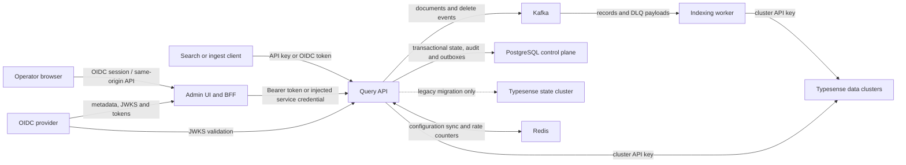

# IMPOSBRO Search Threat Model

Status: baseline threat model, 2026-07-10. This document records the current
implementation and known gaps. It is not a certification or a claim of
compliance.

## Scope and security objectives

The scoped system is the IMPOSBRO Search control plane, data-plane Query API,
Admin UI/BFF, Kafka indexing path, and their connections to Redis and Typesense.
External identity providers, ingress controllers, Kafka/Redis/Typesense
deployments, cloud key managers, and operator endpoints remain separate systems
whose controls must be verified in each deployment.

The primary objectives are:

- prevent cross-tenant and unauthorized collection access;
- protect OIDC tokens, API keys, cluster credentials, documents, routing state,
  backups, and audit evidence;
- preserve the integrity and ordering of control-plane and indexing mutations;
- continue serving safely during dependency failure without silently bypassing
  authorization or data-placement policy;
- provide evidence that sensitive actions and security failures are attributable.

## Assets and impact

| Asset | Confidentiality impact | Integrity/availability impact |
| --- | --- | --- |
| OIDC access tokens and Admin UI session cookies | Account and operator impersonation | Unauthorized control-plane operations |
| Admin, data-plane, internal and Typesense API keys | Broad service or data access | Cluster takeover and data corruption |
| Indexed documents and Kafka/DLQ payloads | Tenant or personal-data disclosure | Search corruption, deletion or stale results |
| Routing rules, schemas, aliases and cluster registry | Infrastructure topology disclosure | Misrouting, outage or policy violation |
| State snapshots and downloaded backups | Cluster credentials may be present | Invalid restore or rollback |
| Audit/security events and request identifiers | Operational metadata disclosure | Loss of forensic evidence and accountability |

## Actors

- unauthenticated Internet or internal-network caller;
- authenticated search/ingest client with collection-scoped permissions;
- tenant user carrying OIDC tenant claims;
- read-only, write, backup, restore, and internal-service operator;
- indexing workload and other service identities;
- platform administrator controlling deployment configuration;
- compromised browser, dependency, workload, Kafka producer, or data cluster;
- accidental operator making a destructive or conflicting change.

## Trust boundaries and data flows

Every arrow crossing a process, namespace, network, or administrative ownership
boundary must be authenticated, encrypted outside isolated development
environments, authorized to the smallest resource set, and observable without
logging credentials or document bodies.

## Existing controls

- Query API OIDC validation checks asymmetric signatures, issuer, audience and
  token lifetime; Admin UI login uses Authorization Code with PKCE, state and
  nonce and seals its session cookie using authenticated encryption.
- API-key comparison is constant-time, admin operations have distinct scopes,
  and collection glob scopes are enforced in the trusted Query API.
- Configured tenant policies inject server-side search/delete filters and reject
  writes whose tenant values exceed the caller's claims.
- Cluster credentials are masked in ordinary Admin API responses and state
  exports unless an operator explicitly requests a restore-ready export.
- Request identifiers cross HTTP and Kafka paths, container images run as
  non-root users, and Helm production images must be digest-pinned.
- Enterprise state, audit, control notifications, indexing events, sequence
  heads, and fenced worker checkpoints are persisted transactionally in
  PostgreSQL. Mutations use revision compare-and-swap; audit entries form a hash
  chain and share the state transaction or a durable outbox.
- Kafka producer and consumer clients support TLS, hostname verification and
  SASL; PostgreSQL, Redis and Typesense endpoints have fail-closed enterprise
  TLS configuration and a mounted private trust bundle.
- Kubernetes workloads use explicit component-scoped Secret key references.
  Sharing an ExternalSecret object does not expose UI session credentials to
  the API/worker or control/data credentials to the UI.
- Admin UI responses now receive a default CSP, framing restriction, MIME
  sniffing protection, referrer policy, and production HSTS from
  `admin_ui/next.config.js`. These build-time defaults do not replace ingress
  verification.
- Admin UI browser mutations fail closed on an exact public Origin and
  `Sec-Fetch-Site: same-origin`; logout is POST-only; auth and proxy responses
  force no-store; and locally caught failures expose generic stable errors.
- Production and enterprise BFFs do not inject server-held API keys by default.
  The trusted-header path is an explicit legacy opt-in and is stripped before
  forwarding; browser OIDC never falls back to that path.
- Form errors, destructive dialogs, notifications, skip navigation, and active
  navigation expose baseline keyboard and assistive-technology semantics.

## Threat register

| ID | STRIDE | Scenario and affected boundary | Current treatment | Residual risk / required control | Priority |
| --- | --- | --- | --- | --- | --- |
| T-01 | Spoofing / elevation | A caller supplies the Admin UI's trusted upstream header and receives injected server credentials. | Injection is disabled by default in production/enterprise. Legacy mode requires an explicit mode, explicit risk opt-in, exact header/value, and strips the header before forwarding. | Prove the ingress removes caller values before setting its own; replace shared header trust with signed, audience-bound assertions or verified OIDC plus mTLS. | P0 |
| T-02 | Information disclosure / elevation | Missing tenant policy or the API-key tenant bypass exposes every tenant in a collection. | Enterprise mode rejects collections without an explicit policy, requires bypass off, validates tenant claims, and injects server-side filters across read/write/delete paths. | Bind machine identities to tenants and retain live negative isolation evidence for every exposed data path. | P1 |
| T-03 | Information disclosure | A cluster secret reference is resolved by the wrong workload, leaks through logs/export, or a revoked value remains usable. | Control-plane state/export persist references only; bounded env/file resolution is workload-side, raw secret transit is restricted to the authenticated internal path, and logs/ordinary exports remain redacted. | Prove the exact-commit env/file rotation and revoked-key scenario, deploy least-privilege secret-manager/mount policy, and retain access/revocation evidence. | P0 |
| T-04 | Spoofing / disclosure | Static service keys or plaintext backend connections are intercepted or reused. | Enterprise configuration requires validated TLS/SASL, hostname checks and private trust roots; worker and UI receive distinct scoped credentials. | Replace long-lived keys with workload identity/mTLS and prove live rotation and revocation. | P1 |
| T-05 | Repudiation | Authentication failures, authorization denials or sensitive reads are absent from audit, or a database operator alters audit state. | State mutations and hash-chained audit commit atomically. A minimum event catalog exists; provider-neutral delivery checkpoints use exact hash/sequence acknowledgements with durable redacted retry state and alerts. | Complete emission across every auth/denial path and deploy a verified independently controlled append-only sink; the repository adapter does not claim WORM. | P1 |
| T-06 | Tampering | Concurrent control-plane writes overwrite each other or a restore replaces newer state. | PostgreSQL revisions, ETag/If-Match CAS, serialized migrations, immutable federation snapshots and polling reconciliation reject stale writers and converge replicas. | Require the same CAS/maintenance freeze around deployment-specific restore automation and retain multi-region restore evidence. | P1 |
| T-07 | Tampering / repudiation | An ingest retry creates duplicate Kafka effects or clients cannot prove completion of an asynchronous delete. | Durable event heads/outbox allocate identity sequence numbers; canonical envelopes carry idempotency/operation metadata; the worker fences checkpoints and applies tombstones idempotently. Tombstones atomically register a durable per-target deletion ledger and replay suppression boundary. | Deploy target reconciliation, then prove completion across broker, DLQ, every target, logs and restored backups. | P1 |
| T-08 | Denial of service | Large documents, query expressions, vector payloads, expensive searches or bursts exhaust API and backend resources. | Batch count, pagination window and optional fixed-window limits exist. | Enforce body/field/query-cost/concurrency limits and distributed production quotas; define fail-open/closed policy. | P1 |
| T-09 | Information disclosure | Documents persist in Kafka, DLQ, backup or browser cache after an API delete. | Delete/tombstone events atomically create a durable restore-suppression ledger. A provider-neutral reconciler rejects replay at or below the tombstone and requires per-target applied/absent receipts before traffic. | Deploy target adapters, prove broker/log/backup expiry and restored-target reconciliation, and complete the DSAR/legal-hold approval workflow. | P0 |
| T-10 | Information disclosure / XSS | Compromised content or dependency executes in the Admin UI or leaks referrers. | React escaping and a static security-header baseline are present. | Remove CSP `unsafe-inline` with per-response nonces/hashes, validate ingress headers, add DAST and dependency gates. | P1 |
| T-11 | CSRF / session abuse | A browser session triggers a sensitive BFF operation cross-site or remains usable after logout/account disable. | Unsafe auth/BFF routes require exact Origin plus same-origin Fetch Metadata; logout is POST-only and cookies are sealed, HttpOnly, SameSite and bounded by an absolute expiry. | Add deployed multi-browser CSRF evidence, idle timeout, token revocation/back-channel logout and step-up authentication. | P1 |
| T-12 | SSRF | An operator registers or restores an arbitrary cluster host and the Query API connects from a privileged network. | Cluster names and protocols are validated. | Constrain destinations by policy/egress allowlist, resolve safely, and test cloud-metadata/private-range denial where required. | P1 |

## Security-header configuration

`admin_ui/next.config.js` evaluates these values while building the standalone
Admin UI. Runtime policy differences should be enforced by a trusted ingress and
tested against the deployed response.

| Variable | Default |
| --- | --- |
| `ADMIN_UI_SECURITY_HEADERS_ENABLED` | `true` |
| `ADMIN_UI_CSP_ENABLED` | `true` |
| `ADMIN_UI_CONTENT_SECURITY_POLICY` | compatible built-in policy |
| `ADMIN_UI_CSP_CONNECT_SRC` / `ADMIN_UI_CSP_IMAGE_SRC` | no additional sources |
| `ADMIN_UI_FRAME_ANCESTORS` | `'none'` |
| `ADMIN_UI_NOSNIFF_ENABLED` | `true` |
| `ADMIN_UI_REFERRER_POLICY_ENABLED` | `true` |
| `ADMIN_UI_REFERRER_POLICY` | `strict-origin-when-cross-origin` |
| `ADMIN_UI_FRAME_OPTIONS_ENABLED` | `true` for policies expressible by X-Frame-Options |
| `ADMIN_UI_HSTS_ENABLED` | `true` in production, otherwise `false` |
| `ADMIN_UI_HSTS_MAX_AGE_SECONDS` | `31536000` |
| `ADMIN_UI_HSTS_INCLUDE_SUBDOMAINS` | `true` |
| `ADMIN_UI_HSTS_PRELOAD` | `false` |

The runtime browser/BFF boundary is configured separately. Production and
enterprise deployments require an HTTPS `ADMIN_UI_PUBLIC_ORIGIN`; static key
injection defaults to disabled; OIDC issuer/endpoints are HTTPS and
issuer-origin-bound; and all OIDC network calls have bounded timeouts. See
`docs/ADMIN_UI_SECURITY.md` for the exact variables, legacy compatibility mode,
and migration contract.

Do not enable HSTS preload until every relevant hostname is permanently HTTPS
and the organizational owner accepts the preload removal constraints. A custom
CSP is normalized so the separately configured `frame-ancestors` boundary still
applies. The current compatible policy uses `unsafe-inline`; it is a migration
baseline, not the target state.

## Verification and ownership

- Security owners review this threat model for authentication, tenancy,
  persistence, routing, backup, network, or browser-boundary changes.
- Each accepted risk needs an owner, expiry, compensating control and link to
  runtime evidence.
- Unit tests are necessary but insufficient. Release evidence should include
  real OIDC role tests, cross-tenant integration tests, TLS/SASL tests, browser
  security-header/CSRF tests, dependency and secret scans, DAST, and restore and
  deletion exercises.
- Revisit this model at least quarterly and after an incident or material
  architecture change.
