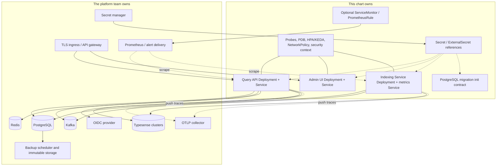
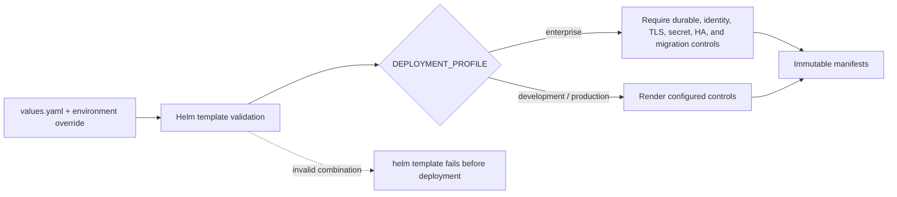
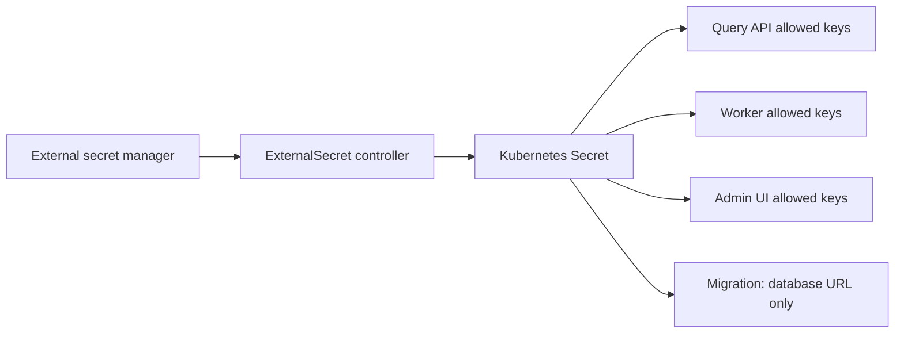
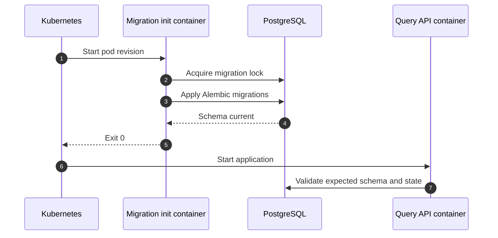

# IMPOSBRO Search Helm chart

This chart deploys the three IMPOSBRO application workloads to Kubernetes:

- Query API;
- Admin UI;
- Indexing Service.

It also renders their services, probes, security contexts, service account, optional ingress, scaling, disruption, network, monitoring, secret-integration, and PostgreSQL migration contracts.

## Deployment boundary



The chart deliberately does **not** install PostgreSQL, Kafka, Redis, Typesense, an OIDC provider, cert-manager, an ingress controller, External Secrets Operator, KEDA, Prometheus Operator, an OTLP collector, or a backup system. Installing stateful and organizational dependencies inside an application chart would hide ownership and recovery boundaries.

## Profiles

`values.yaml` is a configurable baseline and defaults to a development-oriented profile. It is not a production values file.

`enterprise-ci-values.yaml` is a non-secret render fixture that exercises the fail-closed chart contract. It demonstrates required shapes and controls; its example hostnames, secret keys, storage references, and CIDRs are not deployable production values.



The enterprise profile rejects incomplete or contradictory combinations during rendering and the applications validate runtime settings again at startup.

## Enterprise fail-closed checks

The chart's helpers validate, among other things:

- digest-pinned application images and immutable release metadata;
- PostgreSQL control-plane, event-store, and worker checkpoint backends;
- the migration init path and its least-privilege secret scope;
- exactly one secret source and explicit per-workload secret-key allowlists;
- OIDC, tenant/collection policy, authenticated data/admin planes, and server-side Admin UI identity;
- TLS/SASL Kafka, TLS Redis/PostgreSQL, trust bundles, and protected OTLP;
- distributed fail-closed rate limiting;
- tamper-evident audit logging/export and enterprise telemetry identity;
- ingress TLS, restricted pod/container security, resources, PDBs, anti-affinity/topology spread;
- explicit NetworkPolicy ingress/health sources and modeled egress;
- coherent HPA/KEDA settings and minimum availability.

Passing template validation means the chart-enforced declarations are internally consistent. Optional monitoring resources, external audit delivery, and other environment-owned integrations still need explicit values and live evidence. Rendering does not prove that an external endpoint, credential, certificate, policy, alert receiver, or backup actually works.

## Secrets

Exactly one secret source must be selected:

| Mode | Use |
|---|---|
| Managed chart Secret (`config.useSecret`) | Local/test convenience; forbidden by enterprise profile because values would carry raw secret material. |
| Existing Kubernetes Secret (`secrets.existingSecret`) | Platform creates/rotates the Secret outside Helm. |
| ExternalSecret (`secrets.externalSecret.enabled`) | Chart renders an External Secrets Operator resource that maps remote keys into the release Secret. |



`secrets.providedKeys` declares available keys, and `secrets.workloadKeys` limits which workload receives each key. The enterprise rules reject cross-boundary credentials—for example, the browser workload must not receive cluster secrets. `secrets.rolloutVersion` is an explicit rotation token that deterministically rolls pods when an externally managed Secret changes.

Never place secret values in a committed values file, Helm command history, ConfigMap, or rendered artifact.

## Database migrations

When migrations are enabled, the Query API pod runs a migration init container before the application container. It uses the same immutable Query API image, a PostgreSQL advisory lock, and a secret scope containing only `CONTROL_PLANE_DATABASE_URL`.



The chart does not create or own the database. Production rollout policy must still cover backup, migration compatibility, rollback, and multiple release revisions. See [../docs/RELEASE_ROLLBACK.md](../docs/RELEASE_ROLLBACK.md).

## Networking and ingress

Query API and Admin UI Services default to `ClusterIP`; expose them through an authenticated TLS gateway/ingress. The Indexing Service exposes metrics/health only as configured and is not a public data endpoint.

NetworkPolicy is opt-in in the baseline and mandatory in the enterprise profile. Configure actual namespace/pod selectors and CNI-appropriate node/kubelet health sources. NetworkPolicy can authorize network peers and ports, not HTTP paths; do not assume that allowing a probe port authorizes only `/health`.

Egress policy must account for DNS plus the exact PostgreSQL, Kafka, Redis, Typesense, OIDC/JWKS, OTLP, and other required destinations. Empty placeholder rules are not a safe enterprise policy.

## Availability and scaling

Each workload supports replicas, rolling-update parameters, topology spread, anti-affinity, resource requests/limits, and PodDisruptionBudgets.

- Query API and Admin UI support `autoscaling/v2` HPA by CPU and/or memory.
- Indexing Service supports either HPA or Kafka-lag KEDA, never both at once.
- KEDA can render a `ScaledObject` and a least-privilege `TriggerAuthentication` using secret references and TLS/SASL settings.

Worker scale is bounded by Kafka partitions and downstream capacity. Query API scale requires PostgreSQL control/event stores, Redis-backed quotas, and coherent config convergence. Increasing replica counts without these shared durable/distributed backends is rejected where the chart can detect it.

See [../docs/RUNBOOK_SCALING.md](../docs/RUNBOOK_SCALING.md) for sizing and rollout procedures.

## Probes and degraded search

The Query API readiness probe uses `/ready`; liveness uses `/`. Serving readiness can remain true when a data cluster is unavailable because the API can return explicit partial federated results. Detailed `/health` still reports the dependency degradation. Set strict dependency readiness only when environment policy prefers removing all replicas over serving partial results.

The worker has separate health and metrics ports. Startup/readiness settings must allow dependency and configuration bootstrap without masking a permanently unusable consumer.

## Monitoring

When the Prometheus Operator CRDs are present, the chart can render:

- `ServiceMonitor` resources for Query API and worker metrics;
- a `PrometheusRule` with availability, latency, rate-limit, retry, DLQ, and loaded-cluster signals.

The deeper exporter, dashboard, SLO, and alert-delivery contracts live in [../monitoring/README.md](../monitoring/README.md). A rendered rule is not evidence that Prometheus discovered it or that a page reached the on-call team.

## Install workflow

Create a private values file outside source control. At minimum it must provide immutable images, dependency endpoints, selected secret integration, trust material references, ingress, resources, and the chosen profile's controls.

```bash
# Render and inspect without changing a cluster
helm template imposbro ./helm \
  --namespace imposbro \
  --values /secure/path/imposbro-production.yaml

# Server-side validation when a target cluster and CRDs are available
helm upgrade --install imposbro ./helm \
  --namespace imposbro \
  --create-namespace \
  --values /secure/path/imposbro-production.yaml \
  --dry-run=server

# Deploy after review
helm upgrade --install imposbro ./helm \
  --namespace imposbro \
  --create-namespace \
  --values /secure/path/imposbro-production.yaml \
  --atomic \
  --wait
```

Use a deployment system that protects values and rendered manifests from secret leakage. Prefer GitOps with secret references and policy checks over manual production Helm commands.

## Verification

From the repository root:

```bash
# Chart-specific render assertions, including invalid combinations
python3 scripts/test-helm-chart.py

# Repository Helm gate (uses the pinned/available Helm binary)
make helm

# Disposable multi-node Kubernetes disruption/load path
./scripts/e2e/run-kind-enterprise-smoke.sh
```

The kind harness builds current application images, resolves immutable digests, creates disposable infrastructure, validates disruption and load scenarios, records evidence, and cleans up by default. Read [../ops/kind/README.md](../ops/kind/README.md) before running it.

## Values map

| Section | Controls |
|---|---|
| `queryApi`, `adminUi`, `indexingService` | Images, replicas, services, ingress, probes, resources, rollout, HPA/KEDA |
| `serviceAccount` | Dedicated identity and token automount policy |
| `podSecurityContext`, `securityContext`, `writableTmpDir` | Restricted runtime posture |
| `availability` | Common anti-affinity behavior |
| `networkPolicy` | Ingress, probes, scrape access, and egress contracts |
| `monitoring` | ServiceMonitor and PrometheusRule resources |
| `secrets` | Selected source, key inventory, workload scopes, rotation token |
| `tls` | Trust-bundle Secret and mounted certificate paths |
| `migrations` | PostgreSQL schema init and lock behavior |
| `config` | Non-secret application environment contract |

Keep environment-specific values in the deployment repository that owns the cluster. Keep this chart provider-neutral and validate new switches in `templates/_helpers.tpl` and `scripts/test-helm-chart.py`.
