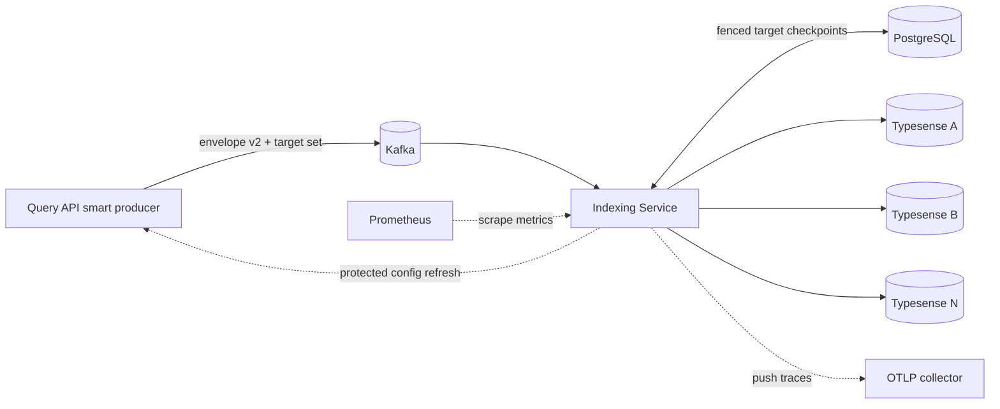
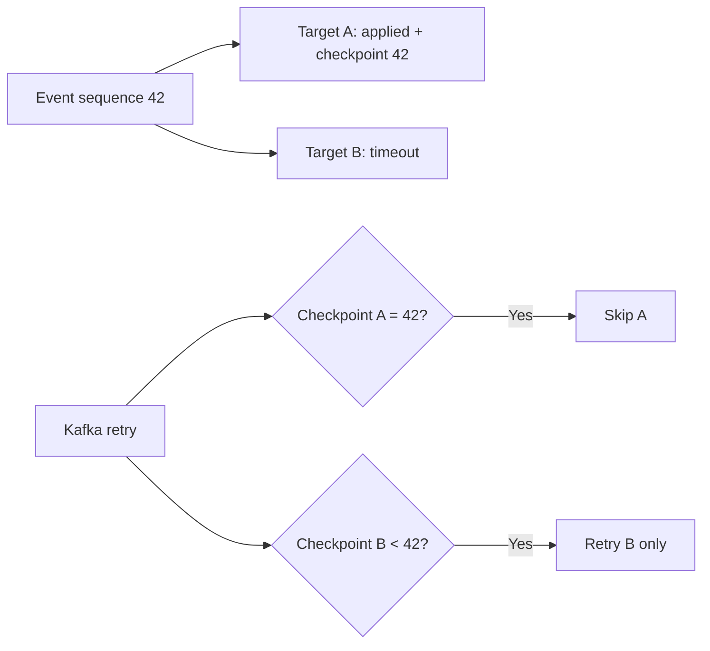

# Indexing Service

The Indexing Service is the asynchronous delivery worker for IMPOSBRO Search. It consumes canonical envelope-v2 records from Kafka and applies their already-resolved target operations to Typesense without recomputing routing.

Its core promise is deliberately narrow:

> apply each logical event to every target safely under duplicate delivery, retries, worker concurrency, partial target failure, and restart.

The service provides **at-least-once, monotonic, per-target delivery**. It does not claim a cross-Kafka/PostgreSQL/Typesense exactly-once transaction.

## Place in the platform



The worker retrieves materialized cluster connection data from the Query API's protected internal endpoint. Routing policy remains private to the Query API; the event says which targets must receive the operation.

## Canonical event envelope

Envelope v2 is defined in [EVENT_ENVELOPE_V2.md](EVENT_ENVELOPE_V2.md) and validated against [../contracts/indexing-event-v2.schema.json](../contracts/indexing-event-v2.schema.json).

The important groups are:

| Group | Purpose |
|---|---|
| Identity | tenant, collection, and document ID; internal stores derive a deterministic hash from them |
| Ordering | document version, per-identity sequence, event time |
| Routing | routing revision, optional rollout ID, and explicit target cluster list |
| Operation | upsert, delete, or tombstone payload/filter |
| Trace | request ID and trace context without document payload leakage |
| Idempotency | stable event/idempotency information for safe retry |

The Kafka key must match the envelope identity key. Events for the same tenant/collection/document are therefore ordered by a partition, while unrelated documents can process concurrently. Kafka does not provide a single global order for the platform.

## Processing algorithm

```mermaid
sequenceDiagram
    autonumber
    participant K as Kafka
    participant W as Worker
    participant P as PostgreSQL checkpoint store
    participant T as Typesense target(s)
    participant D as DLQ

    K->>W: Record + key
    W->>W: Parse strict envelope v2 and verify key
    W->>P: Open fenced scope and lock target checkpoints
    P-->>W: Current position for every target
    W->>W: Classify apply / duplicate / stale
    loop Each target that needs apply
        W->>T: Upsert or idempotent delete
        T-->>W: Success / missing-delete / failure
        W->>P: Save successful target position
    end
    alt All targets terminal
        W->>K: Commit source offset
    else Retryable failure within budget
        W->>W: Backoff; optionally refresh cluster config
        W->>P: Reopen scope; completed targets now skip
    else Non-retryable or exhausted
        W->>D: Publish failure record and flush
        alt DLQ durable
            W->>K: Commit source offset
        else DLQ failed
            Note over W,K: Source offset remains uncommitted
        end
    end
```

### Decision rules

- **apply**: the incoming monotonic position is newer than the target checkpoint;
- **duplicate**: the target recorded the same event ID, position, operation, and mutation digest;
- **stale**: a newer event has already crossed the scope, so the old event must not be applied;
- **delete missing**: Typesense reports no document; this is a successful idempotent no-op.

If one target has already advanced beyond an event, the worker suppresses that stale event for lagging targets too. This prevents an old fan-out delivery from resurrecting or completing an obsolete state after a newer document version exists.

## Why checkpoints are per target

One logical event can fan out to several physical clusters. Consider target A succeeding and target B timing out:



Committing A's progress prevents an expensive or dangerous full replay. The source Kafka offset is still not committed until the complete event has a terminal outcome. A process crash after a Typesense side effect but before its checkpoint can cause the side effect to run again; Typesense upsert and idempotent delete semantics make that safe.

## PostgreSQL fencing

The enterprise checkpoint adapter uses PostgreSQL advisory locking and monotonic compare-and-swap behavior. Targets are locked in deterministic order to reduce deadlock risk. The scope prevents concurrent consumers from moving a target backwards while allowing unrelated document identities to progress.

Available backends are:

| Backend | Intended use |
|---|---|
| `postgres` | Enterprise and multi-worker deployments. |
| `memory` | Explicit single-process development/test only; progress disappears on restart. |
| `typesense` | Legacy development compatibility only and guarded by an explicit opt-in. |

`INDEXING_ALLOW_VOLATILE_CHECKPOINTS=true` and `INDEXING_ALLOW_TYPESENSE_CHECKPOINTS=true` are development escape hatches. The enterprise profile rejects them.

## Retry and DLQ behavior

Failures are classified before retry:

- a missing/changed cluster can trigger a protected configuration refresh and retry;
- temporary provider/network errors use bounded retry and backoff;
- invalid envelopes, key mismatch, impossible ordering, or other non-retryable records go to the DLQ path;
- an exhausted retry budget also goes to DLQ;
- the source offset advances only after the DLQ producer acknowledges and flushes the failure record.

The DLQ is an operational quarantine, not silent success. Resolution uses the guarded [manual resolver](../scripts/ops/dlq_resolver.py), audit/evidence policy, and [outbox/DLQ runbook](../docs/runbooks/outbox-lag.md). Operators must not skip offsets by editing Kafka state manually.

## Delete behavior

Delete envelopes contain the document identity, all candidate target clusters, and—when tenant policy is active—a server-generated ID-and-tenant filter. The worker:

1. validates the envelope and target scope;
2. deletes from each target;
3. treats a missing document as success;
4. records the per-target monotonic checkpoint;
5. commits the source offset only after terminal outcomes.

This makes client retry safe and covers historical placements. Production proof of erasure still requires the deletion ledger and environment reconciliation described in [../docs/DATA_LIFECYCLE.md](../docs/DATA_LIFECYCLE.md).

## Health and observability

The service exposes:

- Prometheus metrics on port `9108` by default;
- a health/readiness server on its configured health port (Helm default `9109`);
- a Kafka processing span with Typesense child spans;
- bounded logs that carry request/trace correlation without indexing document payloads.

Readiness requires a usable consumer/configuration state. Metrics distinguish processed, retried, failed, DLQ, checkpoint, and loaded-cluster conditions. High-cardinality event/request IDs belong in logs and traces, not metric labels.

## Configuration

The worker reads validated environment values at startup. Important groups include:

| Group | Examples |
|---|---|
| Kafka | broker URL, consumer group, topic pattern/prefix, TLS/SASL files, retry/DLQ limits |
| Checkpoints | backend, PostgreSQL URL, lock timeout, guarded legacy/volatile opt-ins |
| Query API bootstrap | internal URL and server-side internal credential |
| Typesense | materialized cluster nodes, protocol, and secret values resolved by the API |
| Telemetry | metrics/health ports, OTLP endpoint and TLS, release metadata |

See [../.env.example](../.env.example) and [../helm/values.yaml](../helm/values.yaml). Keep Kafka consumer group names synchronized with monitoring rules, dashboard selectors, KEDA, and the DLQ resolver.

## Code map

```text
app/main.py              process lifecycle, cluster bootstrap/refresh, health, metrics
app/consumer.py          Kafka setup, envelope processing, retry, DLQ, offset rules
app/event_envelope.py    strict envelope-v2 validation and identity/key checks
app/checkpoint_store.py  memory, legacy Typesense, and PostgreSQL checkpoint adapters
app/metrics.py           bounded Prometheus metric contracts
app/telemetry.py         OpenTelemetry setup and payload-safe spans
tests/                   decision, retry, fencing, telemetry, and integration coverage
```

## Development and verification

From the repository root:

```bash
# Runs Query API and Indexing Service Python tests using the repository runner
npm run test:api

# Full repository suites
npm test

# Live enterprise path with disposable dependencies (see its README first)
./scripts/e2e/run-enterprise-e2e.sh
```

The live harness starts infrastructure and cleans it automatically; use it only when Docker resources are available. Static/unit work does not require a broker or Typesense process.
