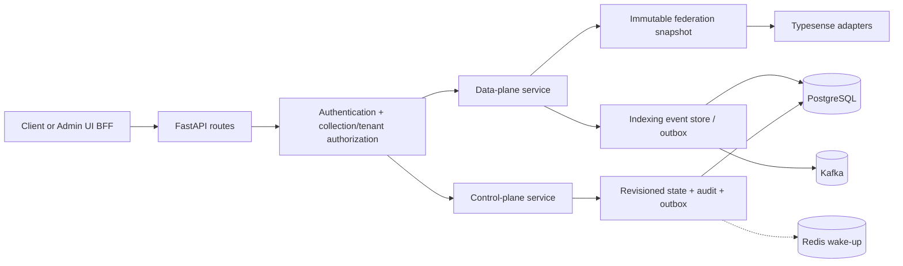
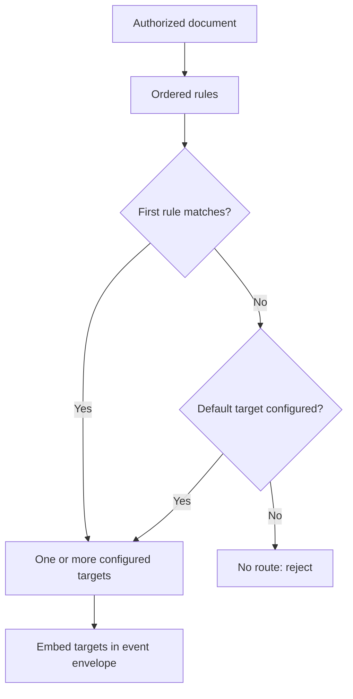
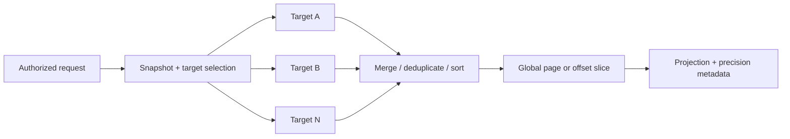

# Query API

The Query API is the synchronous boundary of IMPOSBRO Search. It exposes the public data API and the protected control-plane API, then composes authorization, routing, durable intent, federated search, health, metrics, and tracing.

## Responsibilities



The API owns **routing decisions**. The Indexing Service receives already-materialized target names and connection configuration; it does not interpret routing rules.

## API surface

The canonical API prefix is `/api/v1`. Unversioned endpoints are mounted as compatibility aliases; legacy admin/collection routes advertise successor-version metadata, while the data aliases currently remain compatible without that header. New integrations should use the versioned paths and the versioned OpenAPI document at `/api/v1/openapi.json`.

### Data plane

| Method and path | Purpose |
|---|---|
| `POST /api/v1/ingest/{collection}` | Validate, authorize, route, durably sequence, and publish one upsert. |
| `POST /api/v1/ingest/{collection}/batch` | Run the same flow independently for each bounded batch item. |
| `GET /api/v1/search/{collection}` | Federated lexical or compact-parameter search. |
| `POST /api/v1/search/{collection}` | Federated search with a JSON body; preferred for vector/hybrid parameters. |
| `GET /api/v1/documents/{collection}/{id}` | Return the first authorized document copy across covered clusters. |
| `DELETE /api/v1/documents/{collection}/{id}` | Queue an idempotent delete across every cluster that may contain a copy. |

### Control plane

All control-plane endpoints live below `/api/v1/admin`. They manage:

- registered data clusters and runtime-safe secret references;
- collection schemas and aliases;
- routing previews and policies;
- safe routing rollouts, bounded backfill, parity, cutover, drain, and rollback;
- masked state export, guarded restore/reconcile, audit, and operational evidence;
- an internal cluster-materialization endpoint used only by the Indexing Service.

Use the generated OpenAPI schema as the endpoint-level contract. Enterprise mutations require the current revision in `If-Match`; successful responses expose `ETag` and `X-Control-Plane-Revision`.

### Service endpoints

| Path | Meaning |
|---|---|
| `/` | Liveness-friendly service identity. |
| `/health` | Detailed component health, revision, and dependency diagnostics. |
| `/ready` | Serving readiness. Degraded data clusters need not remove a useful partial-search replica from service. |
| `/metrics` | Prometheus metrics. |
| `/docs` | Interactive OpenAPI UI. |

## Ingest contract

```mermaid
sequenceDiagram
    autonumber
    actor C as Caller
    participant R as Data route
    participant F as Federation service
    participant E as Event store
    participant K as Kafka producer

    C->>R: Document + auth + optional idempotency metadata
    R->>R: Validate id and enforce tenant ownership
    R->>F: Resolve active/rollout write targets
    F-->>R: target set + routing revision + rollout id
    R->>E: Prepare canonical envelope v2
    E->>E: Lock identity, check idempotency, allocate sequence, commit outbox
    R->>K: Send keyed event with acks=all; flush
    alt Acknowledged
        R->>E: Mark outbox published
        R-->>C: Accepted + routed_to
    else Failed
        R-->>C: Error; pending row remains replayable
    end
```

The response is not a promise that the document is already searchable. It means the synchronous acceptance path completed. A background dispatcher republishes pending rows. A crash after Kafka acknowledgement but before the publish marker may duplicate an event, so downstream processing is intentionally at least once.

An idempotency key may be retried with the same logical content. Reusing it for different content returns a conflict. In PostgreSQL mode the event store allocates a monotonic position for each tenant/collection/document identity.

## Routing model

Rules are evaluated by priority/order. Supported match types are exact equality, membership in a list, glob, and numeric range. A matching rule may return one target or a fan-out target set; otherwise the collection default applies.



During safe migration the rollout phase derives separate read and write policies. The federation snapshot contains this decision, so both ingest and search use one coherent revision.

## Federated search contract

The request path:

1. authenticates the caller and applies collection and tenant policy;
2. captures one immutable federation snapshot;
3. selects every cluster covered by the current read policy;
4. searches those clusters concurrently;
5. fetches bounded shard windows in pages no larger than Typesense's per-page limit;
6. merges, deduplicates by document ID, globally sorts, slices, and projects;
7. returns response metadata that states partial failure and count precision.



If at least one target succeeds, the API can return a useful result; failed targets appear in `failed_clusters` and `partial` is true. If every eligible target fails, the API returns `503`. No eligible collection/cluster is `404`.

The `found_relation` field prevents false precision:

- `exact` only when exactly one target was eligible and Typesense supplies its count;
- `upper_bound` for multi-shard raw totals when no duplicate was observed;
- `window_lower_bound` when duplicate IDs prove that only the fetched merge window is known.

Only sort expressions that the gateway can reproduce consistently across shards are accepted. Complex provider-specific function/geo sorts fail rather than returning a misleading global order.

## Control-plane commit and convergence

In enterprise mode, a mutation commits the new state, digest, hash-chained audit event, and control-plane outbox in one PostgreSQL transaction guarded by the expected revision. If persistence fails, the handler restores its previous in-memory snapshot.

After commit, Redis is notified for low latency. The durable control outbox retries notification, and every replica periodically compares its applied revision with PostgreSQL. Reload creates a complete new runtime snapshot and swaps it atomically.

This design makes PostgreSQL authoritative and Redis expendable. It also avoids partially updated in-process dictionaries.

## Authentication and authorization

The API supports static/scoped API keys and OIDC JWT bearer tokens. Permissions distinguish admin read/write/backup/restore/internal and data search/ingest scopes. Scopes can be collection-aware.

Optional collection policies enforce a server-side tenant claim/field relationship:

- search adds a tenant filter;
- ingest validates or injects the tenant value;
- read returns tenant-mismatched documents as `404` to avoid disclosure;
- delete embeds an ID-and-tenant filter in the event.

Rate limits use Redis for multi-replica deployments. Memory mode is only suitable for one local process. The enterprise profile requires the distributed backend and fail-closed behavior.

## Configuration and profiles

Settings are parsed once with Pydantic and invalid enterprise combinations fail at startup. See [../.env.example](../.env.example) for the complete annotated list.

Key groups:

| Group | Representative settings |
|---|---|
| Deployment | `DEPLOYMENT_PROFILE`, release/build metadata |
| Control state | `CONTROL_PLANE_STORE_BACKEND`, `CONTROL_PLANE_DATABASE_URL`, reconcile/outbox limits |
| Indexing intent | `INDEXING_EVENT_STORE_BACKEND`, outbox polling/batch settings |
| Messaging | Kafka bootstrap, security protocol, TLS/SASL material, topic prefix |
| Convergence/quota | `REDIS_URL`, configuration sync, rate-limit settings |
| Identity | API keys, OIDC issuer/audience/JWKS, scope mapping, collection policies |
| Search | timeouts, deep-window limits, Typesense node configuration |
| Secrets | file-root and runtime secret-reference policy |
| Telemetry | Prometheus, OTLP endpoint/TLS, release resource attributes |

Do not copy local defaults into production. The `enterprise` profile deliberately rejects legacy/volatile stores, unauthenticated access, incomplete tenant policy, plaintext dependencies, permissive rate limiting, disabled audit logging, and incomplete telemetry identity. Delivery to an independent audit sink remains an environment-owned integration rather than a runtime-profile guarantee.

## Code map

```text
app/main.py                 composition root, lifecycle, probes, metrics, outbox loops
app/settings.py             typed configuration and enterprise fail-closed validation
app/auth.py                 API-key/OIDC scopes and collection/tenant authorization
app/api_contract.py         versioned OpenAPI and stable problem responses
app/routers/search.py       ingest, batch, read, delete, and scatter-gather search
app/routers/admin.py        control-plane commands, audit, rollout, recovery
app/domain/                 provider-independent routing rollout state machine
app/control_plane/          state/audit/outbox/deletion ports and PostgreSQL adapters
app/indexing_events/        envelope, sequencing, idempotency, and outbox adapters
app/services/federation.py  routing, clients, immutable runtime snapshots
app/services/config_sync.py Redis wake-up and durable revision reconciliation
app/services/kafka_producer.py smart producer and indexing outbox publication
alembic/                    PostgreSQL schema migrations
tests/                      unit, contract, and integration coverage
```

## Development and verification

Run from the repository root so the shared environment is used:

```bash
# Query API and Indexing Service Python suites
npm run test:api

# All root test suites
npm test

# Python and Admin UI suites through Make
make test

# Versioned OpenAPI and compatibility contracts
make contracts
```

Live integration tests are explicitly marked and require disposable PostgreSQL, Kafka, Redis, and Typesense infrastructure. The authoritative requirement-to-test mapping is [../docs/TEST_MATRIX.md](../docs/TEST_MATRIX.md).
